# Docking 

A lightweight, feature-rich dock for Linux written in Python with GTK 3 and Cairo. Inspired by [Plank](https://launchpad.net/plank) and [Cairo-Dock](https://github.com/Cairo-Dock), with an extensible applet system for custom widgets.

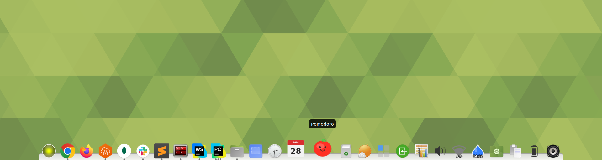

## Features

### Core
- Pinned application launchers with click-to-launch
- Running application indicators (dots) with active window glow
- Parabolic icon zoom on hover with per-icon displacement
- 3D shelf background with gradient fill and inner highlight bevel
- Smart focus: click to focus/minimize, Ctrl+click or middle-click to launch new instance
- Desktop actions (quicklists) from `.desktop` files in the right-click menu
- Multi-position support: bottom, top, left, right

### Visual Effects
- **Hover lighten** -- additive brightness fade on hovered icon
- **Click darken** -- brief sine-curve pulse on click
- **Launch bounce** -- two-bounce momentum decay animation when launching
- **Urgent bounce** -- single bounce when app demands attention
- **Urgent glow** -- pulsing radial glow at screen edge when dock is hidden and an app demands attention
- **Active window glow** -- color-matched gradient using icon's dominant color
- **Cascade hide** -- shelf slides faster than icons for a layered effect
- **Smooth zoom decay** -- icons shrink while dock slides away (no snap)

### Window Previews
- Thumbnails of running windows on hover (X11 foreign window capture)
- Click thumbnail to activate a specific window
- Dock stays visible while browsing previews
- Toggleable via right-click menu

### Drag and Drop
- Drag to reorder icons (with slide animation)
- Drag `.desktop` files from file manager to add icons (gap insertion effect)
- Drag icons off dock to remove (poof smoke animation)
- **Lock Icons** -- toggle via right-click menu to prevent reordering, adding, and removing icons

### Auto-hide
- Cubic easing animation (ease-in hide, ease-out show)
- Configurable delay (0ms default = instant, like Plank)
- 2px trigger strip at screen edge when hidden
- Struts update instantly on toggle (windows resize immediately)

### Applets
Extensible plugin system for custom dock widgets. 18 built-in applets:

| Applet | Description |
|--------|-------------|
| **Clock** | Analog or digital clock with 12/24h modes |
| **Trash** | Trash can with real-time monitoring |
| **Desktop** | Toggle show desktop |
| **CPU Monitor** | Circular gauge with CPU and memory usage |
| **Battery** | Battery charge level with charging indicator |
| **Weather** | Current weather, air quality, and 5-day forecast |
| **Clippy** | Clipboard history manager |
| **Applications** | Categorized application launcher |
| **Network** | WiFi signal strength and traffic speeds |
| **Session** | Lock, logout, suspend, restart, shutdown |
| **Calendar** | Date icon with popup calendar |
| **Workspaces** | Workspace switcher with grid icon |
| **Screenshot** | Capture full screen, window, or region |
| **Volume** | Scroll to adjust, click to mute |
| **Pomodoro** | Tomato timer with auto-cycling work/break phases |
| **Separator** | Transparent gap divider (multiple instances, scroll to resize) |
| **Hydration** | Water drop reminder — drains over time, click to refill |
| **Ambient** | Looping nature sounds and white/pink noise via GStreamer |

See [Applet Documentation](#applets-1) below for details on each applet.

## Requirements

- Linux with X11
- Python 3.10+
- System packages (Ubuntu/Debian):

```bash
sudo apt install \
  python3-gi python3-gi-cairo \
  gir1.2-gtk-3.0 gir1.2-wnck-3.0 gir1.2-gdkpixbuf-2.0 \
  gir1.2-nm-1.0
```

## Installation

```bash
# Clone
git clone https://github.com/edumucelli/docking.git
cd docking

# Create venv with access to system GI bindings
python3 -m venv --system-site-packages .venv
source .venv/bin/activate

# Install with dependencies
pip install -e ".[dev]"
```

Or with [uv](https://docs.astral.sh/uv/):

```bash
uv venv --python /usr/bin/python3 --system-site-packages .venv
source .venv/bin/activate
uv pip install -e ".[dev]"
```

### Building a .deb package

```bash
# Install build dependencies
sudo apt install python3-all python3-setuptools python3-wheel python3-pip \
  debhelper dh-python pybuild-plugin-pyproject

# Build
./packaging/deb/build.sh

# Install generated package
sudo dpkg -i ../docking_*_all.deb
```

## Running

```bash
# Via entry point
docking

# Or directly
python run.py

# With debug logging
DOCKING_LOG_LEVEL=DEBUG python run.py
```

## Configuration

Config is stored at `~/.config/docking/dock.json` (auto-created on first run).

```json
{
  "icon_size": 48,
  "zoom_enabled": true,
  "zoom_percent": 1.5,
  "zoom_range": 3,
  "position": "bottom",
  "autohide": false,
  "hide_delay_ms": 0,
  "unhide_delay_ms": 0,
  "hide_time_ms": 250,
  "previews_enabled": true,
  "lock_icons": false,
  "theme": "default",
  "pinned": ["firefox.desktop", "org.gnome.Nautilus.desktop"]
}
```

| Setting | Default | Description |
|---------|---------|-------------|
| `icon_size` | 48 | Base icon size in pixels (all theme proportions scale with this) |
| `zoom_percent` | 1.5 | Max zoom multiplier (1.5 = 150%) |
| `zoom_range` | 3 | Icon widths over which zoom tapers off |
| `position` | bottom | Dock edge: bottom, top, left, right |
| `autohide` | false | Hide dock when cursor leaves |
| `hide_delay_ms` | 0 | Delay before hiding starts (0 = instant) |
| `hide_time_ms` | 250 | Duration of hide/show slide animation |
| `previews_enabled` | true | Show window preview thumbnails on hover |
| `theme` | default | Theme name (loads from `assets/themes/{name}.json`) |
| `pinned` | [] | Desktop file IDs resolved via `$XDG_DATA_DIRS` |

All settings are also configurable via the dock's right-click menu.

## Managing Dock Items

- **Drag and drop**: Drag a `.desktop` file from your file manager onto the dock
- **Right-click running app**: "Keep in Dock" to pin
- **Drag off**: Drag an icon upward off the dock to remove (poof animation)
- **Right-click pinned app**: "Remove from Dock" to unpin
- **Edit config**: Add desktop IDs to `"pinned"` in `dock.json`

## Applets

Applets are custom widgets that live in the dock alongside application icons. Enable them via right-click on the dock background -> **Applets**.

### Clock

Analog or digital clock face. The analog mode uses SVG layers for a realistic clock face with hour/minute hands.

**Right-click options:**
- **Digital Clock** -- switch between analog and digital display
- **24-Hour Clock** -- toggle 12/24-hour format
- **Show Date** -- show date below time (digital mode only)

**Preferences stored:** `show_digital`, `show_military`, `show_date`

### Trash

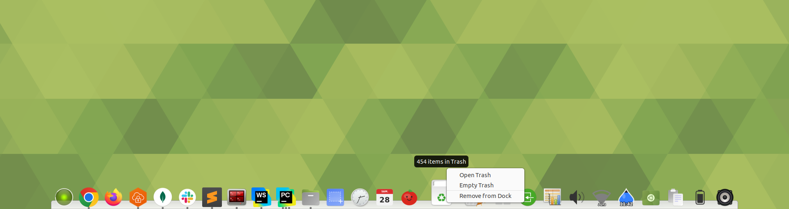

Shows the current state of the system trash. Icon switches between empty and full automatically via file monitoring.

**Click:** Open trash folder in file manager
**Right-click options:**
- **Open Trash** -- open in file manager
- **Empty Trash** -- permanently delete all trashed items (uses Caja/Nautilus DBus when available)

### Desktop

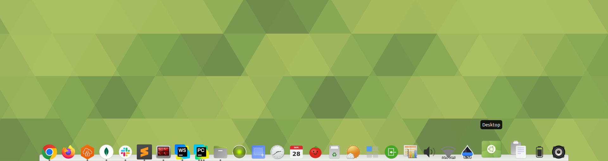

Toggle "show desktop" mode -- minimizes or restores all windows.

**Click:** Toggle show/hide all windows

### CPU Monitor

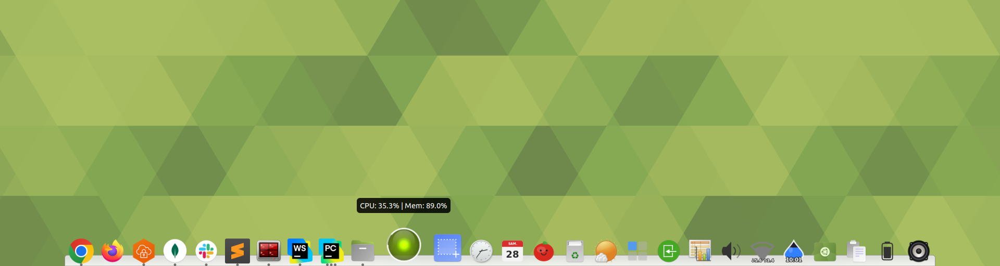

Circular gauge showing real-time CPU and memory usage. The fill color shifts from green (idle) to red (busy). A white arc around the edge shows memory usage.

**Tooltip:** `CPU: 23.5% | Mem: 67.2%`

**Update interval:** 1 second (with 3% CPU / 1% memory threshold to avoid excessive redraws)

### Battery

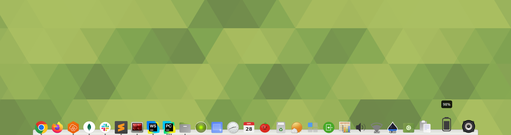

Shows battery charge level using standard FreeDesktop icons. Reads from `/sys/class/power_supply/BAT0/`. Icon changes based on charge level (full, good, low, caution, empty) and charging state.

**Tooltip:** Shows percentage (e.g. "85%") or "No battery"

**Update interval:** 60 seconds

### Weather

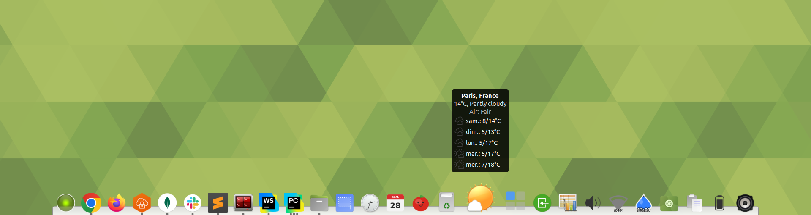

Shows current weather and air quality for a selected city with a 5-day forecast. Uses the [Open-Meteo](https://open-meteo.com/) weather and air quality APIs with automatic caching and retry.

**Click:** Open forecast in browser
**Right-click options:**
- **Show Temperature** -- toggle temperature overlay on icon
- **Change City...** -- opens search dialog with autocomplete (48,000 cities)

**Tooltip:** Bold city header + current conditions + air quality + daily forecast with icons:
```
Contagem, Brazil
29°C, Clear sky
Air: Good
Mon: 25/29°C, Partly cloudy
Tue: 28/32°C, Rain
```

**Preferences stored:** `city_display`, `lat`, `lng`, `show_temperature`

**Update interval:** 5 minutes (shared between API cache and polling timer)

### Clippy

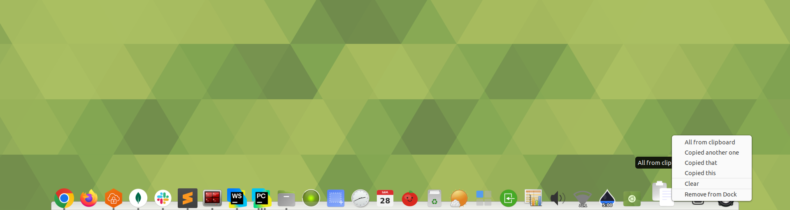

Clipboard history manager. Monitors the system clipboard and stores the last 15 text entries.

**Click:** Copy the currently selected clip back to the clipboard
**Scroll:** Cycle through clipboard history (tooltip updates instantly)
**Right-click:** List of all clips (newest first), click to copy. "Clear" to empty history.

**Preferences stored:** `max_entries`

### Applications

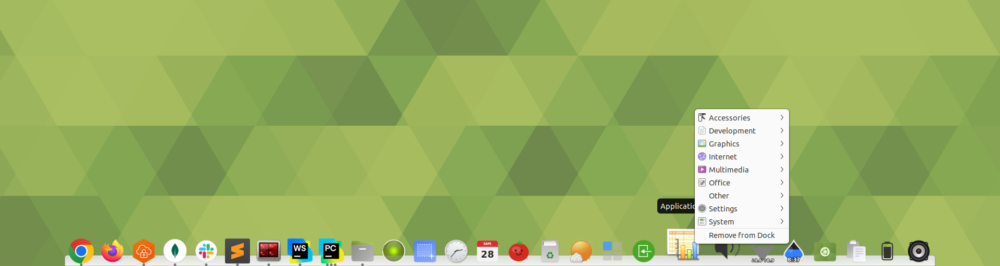

Categorized application launcher. Groups all installed `.desktop` applications by FreeDesktop category (Multimedia, Development, Internet, etc.) with icons.

**Right-click:** Categorized submenus with application icons. Click an app to launch it.

### Network

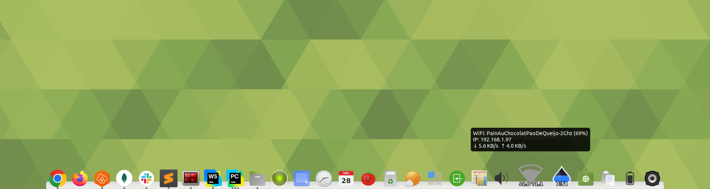

Shows WiFi signal strength or wired connection status, with live upload/download speed overlay.

**Tooltip:**
```
WiFi: MyNetwork (82%)
IP: 192.168.1.42
down-arrow 1.2 MB/s  up-arrow 350 KB/s
```

**Right-click:** Connection info (read-only)

**Data sources:**
- NetworkManager (via NM 1.0) for connection state, SSID, signal strength
- `/proc/net/dev` for traffic counters

**Update interval:** 2 seconds for traffic, instant for connection state changes (NM signals)

### Session

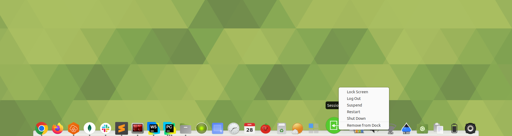

Lock, logout, suspend, restart, or shut down via `loginctl`/`systemctl`.

**Click:** Lock screen
**Right-click options:**
- **Lock Screen** -- `loginctl lock-session`
- **Log Out** -- `loginctl terminate-session`
- **Suspend** -- `systemctl suspend`
- **Restart** -- `systemctl reboot`
- **Shut Down** -- `systemctl poweroff`

### Calendar

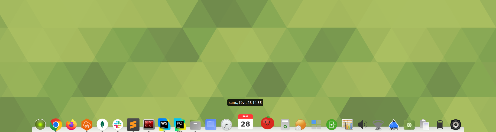

Shows today's date as a calendar page icon with red header (weekday) and day number.

**Click:** Toggle a GtkCalendar popup
**Tooltip:** Full date (e.g. "Tuesday, February 25")

**Update interval:** 30 seconds (refreshes icon at midnight)

### Workspaces

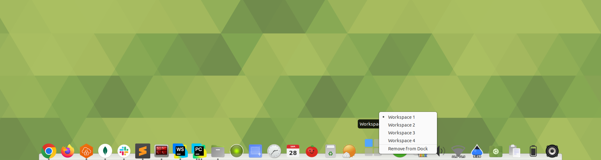

Workspace switcher with a visual grid icon. Active workspace is highlighted in blue.

**Click:** Cycle to next workspace
**Scroll:** Switch workspace up/down
**Right-click options:** Radio list of all workspaces

**Tooltip:** Active workspace name

### Screenshot

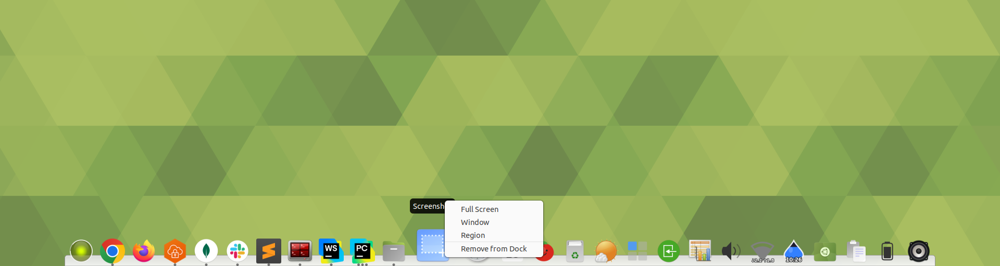

Capture screenshots via the best available tool. Auto-detects mate-screenshot, gnome-screenshot, xfce4-screenshooter, spectacle, flameshot, or scrot.

**Click:** Full-screen capture
**Right-click options:**
- **Full Screen** -- capture entire screen
- **Window** -- capture active window
- **Region** -- interactive area selection

### Volume


System volume control. Auto-detects pactl (PulseAudio/PipeWire) or amixer (ALSA). Icon switches between muted/low/medium/high based on level.

**Click:** Toggle mute
**Scroll:** Adjust volume ±5%
**Tooltip:** `Volume: 75%` or `Muted`

**Update interval:** 1 second (refreshes only on change)

### Pomodoro

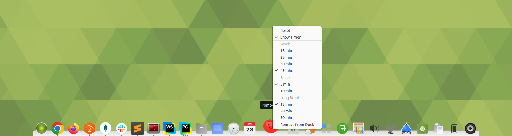

Pomodoro timer with a flat tomato icon. Auto-cycles through work/break phases with configurable durations. Triggers urgent bounce+glow on phase transitions.

**Click:** Start/pause toggle
**Right-click options:**
- **Reset** -- back to idle
- **Work duration** -- 15/25/30/45 min presets
- **Break duration** -- 5/10 min presets
- **Long break duration** -- 15/20/30 min presets

**Preferences stored:** `work`, `break_`, `long_break`

### Separator

Transparent gap divider between dock items. Supports multiple instances -- each with independent, persistent size.

**Scroll:** Adjust gap width (±2px, range 2–48px)
**Right-click options:**
- **Increase Gap** / **Decrease Gap**
- **Remove from Dock**

Added via right-click on dock background -> **Add Separator** (inserts at click position).

### Hydration


Water drop icon that drains over a configurable interval, reminding you to drink water. Click to refill. Triggers urgent bounce when empty.

**Click:** Refill (log a drink)
**Scroll:** No-op
**Right-click options:**
- **Show Timer** -- toggle countdown overlay on icon
- **Interval presets** -- 15/30/45/60/90 min

**Preferences stored:** `interval`, `show_timer`

### Ambient

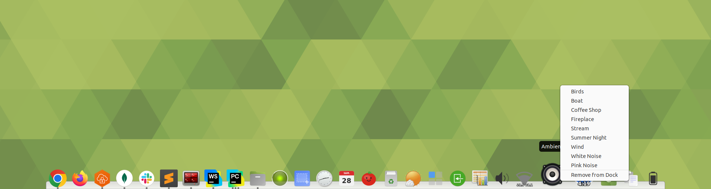

Looping ambient soundscape player. Bundled with 7 CC0/Public Domain nature sounds plus procedural white/pink noise via GStreamer.

**Click:** Toggle play/stop
**Scroll:** Adjust volume ±10%
**Right-click:** Sound selection (Birds, Boat, Coffee Shop, Fireplace, Stream, Summer Night, Wind, White Noise, Pink Noise)

**Preferences stored:** `sound`, `volume`

## Theming

Themes are JSON files in `docking/assets/themes/`. Six built-in themes are included:

- `default` -- light theme
- `default-dark` -- dark variant
- `matte` -- flat appearance
- `transparent` -- minimal, see-through
- `ubuntu-mate` -- matches Ubuntu MATE panel style
- `yaru-dark` -- matches Yaru dark theme

All layout values use a **scaling unit** (tenths of a percent of `icon_size`). This means themes adapt automatically to any icon size.

**Creating a custom theme:** Copy an existing theme JSON and modify the colors and proportions. Place it in the `assets/themes/` directory -- it will appear in the right-click Themes menu.

## Writing Custom Applets

Applets extend the `Applet` abstract base class in `docking/applets/base.py`:

```python
from docking.applets.base import Applet, load_theme_icon

class MyApplet(Applet):
    id = "myapplet"          # unique identifier
    name = "My Applet"       # display name in menus
    icon_name = "my-icon"    # fallback icon

    def create_icon(self, size):
        """Render your icon as a GdkPixbuf at the given size."""
        return load_theme_icon("my-icon", size)

    def on_clicked(self):
        """Handle left-click."""

    def on_scroll(self, direction_up):
        """Handle scroll wheel."""

    def get_menu_items(self):
        """Return list of Gtk.MenuItem for right-click menu."""
        return []

    def start(self, notify):
        """Called after dock is ready. Start timers/monitors."""
        super().start(notify)

    def stop(self):
        """Cleanup. Called on removal or shutdown."""
        super().stop()
```

**Key patterns:**
- Call `self.refresh_icon()` to trigger a redraw after state changes
- Use `self.save_prefs(dict)` / `self.load_prefs()` for persistent preferences
- Use `load_theme_icon(name, size)` for GTK theme icons
- Use `load_theme_icon_centered(name, size)` for non-square icons (e.g. battery)
- For Cairo rendering: create a surface, draw, return via `Gdk.pixbuf_get_from_surface()`
- For background work: use `threading.Thread` + `GLib.idle_add()` to dispatch results to main thread

Register your applet in `docking/applets/__init__.py`:

```python
from docking.applets.myapplet import MyApplet

return {
    ...
    "myapplet": MyApplet,
}
```

## Architecture

```
docking/
+-- app.py                  Entry point, GTK main loop
+-- log.py                  Logging (DOCKING_LOG_LEVEL env var)
+-- core/                   Pure logic, no GTK dependency
|   +-- config.py           Config dataclass, load/save JSON
|   +-- position.py         Position enum (BOTTOM/TOP/LEFT/RIGHT)
|   +-- theme.py            Theme with scaling units, RGB/RGBA types
|   +-- zoom.py             Parabolic zoom math, layout computation
+-- platform/               System integration
|   +-- model.py            DockItem dataclass, DockModel
|   +-- launcher.py         .desktop resolution, icon loading, desktop actions
|   +-- window_tracker.py   Wnck running app detection
|   +-- struts.py           X11 _NET_WM_STRUT_PARTIAL via ctypes
+-- applets/                Extensible applet system (18 applets)
|   +-- base.py             Applet ABC, shared icon loaders
|   +-- clock.py            Analog/digital clock
|   +-- trash.py            Trash monitor
|   +-- desktop.py          Show desktop toggle
|   +-- cpumonitor.py       CPU/memory gauge
|   +-- battery.py          Battery charge
|   +-- clippy.py           Clipboard history
|   +-- applications.py     App launcher
|   +-- network.py          Network status
|   +-- session.py          Session/power actions
|   +-- calendar.py         Calendar icon + popup
|   +-- workspaces.py       Workspace switcher
|   +-- screenshot.py       Screenshot capture
|   +-- volume.py           Volume control
|   +-- pomodoro.py         Pomodoro timer
|   +-- separator.py        Gap divider (multi-instance)
|   +-- weather/            Weather (sub-package)
+-- ui/                     GTK rendering and interaction
|   +-- dock_window.py      Main window, events, input region
|   +-- renderer.py         Draw orchestration, icons, glow, bounce
|   +-- shelf.py            Shelf background (3D bevel)
|   +-- effects.py          Easing bounce, icon color extraction
|   +-- tooltip.py          Tooltip rendering
|   +-- hover.py            Hover tracking, preview timer
|   +-- preview.py          Window thumbnail popup
|   +-- menu.py             Right-click context menus
|   +-- dnd.py              Drag-and-drop
|   +-- poof.py             Poof smoke animation
|   +-- autohide.py         Hide state machine with easing
+-- assets/
    +-- poof.svg            Poof sprite sheet
    +-- themes/             6 JSON themes
    +-- clock/              Clock face SVG layers
    +-- weather/            Cities database (gzipped CSV)
```

## Tests

```bash
# Run all tests
pytest tests/ -v

# Run specific module
pytest tests/applets/test_clock.py -v
```

643 tests covering pure functions, applet behavior, rendering, and UI logic:

```
tests/
+-- core/       config, theme, zoom, position
+-- platform/   model, launcher, struts
+-- applets/    clock, trash, desktop, cpumonitor, battery,
|               weather, clippy, applications, network, registry
+-- ui/         autohide, dnd, effects, hover, input_region,
                leave_behavior, menu, poof, preview, renderer,
                shelf, tooltip, urgent_glow, icon_position
```

**Design principle:** Complex logic is extracted as pure functions (no GTK dependency) so tests run fast without a display server. GTK-dependent tests use lightweight mocks.

## Pre-commit Hooks

Runs automatically on `git commit`:
- **ruff format** -- code formatting
- **ruff check** -- linting (E, W, F, I rules)
- **ty check** -- type checking
- **pytest** -- full test suite

## Contributing

1. Fork the repository
2. Create a feature branch
3. Make your changes (tests required for new features)
4. Run `ruff format docking/ tests/` for formatting
5. Ensure `ruff check && ty check && pytest tests/` passes
6. Submit a pull request

## License

GPL-3.0-or-later
