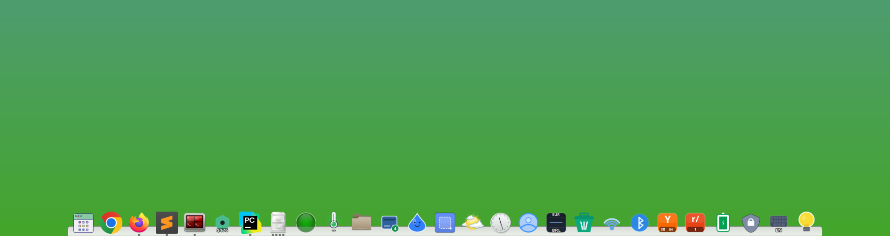
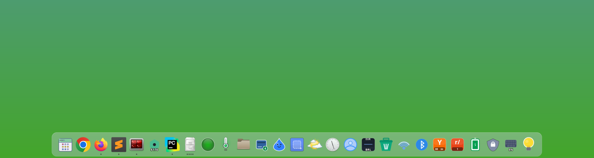
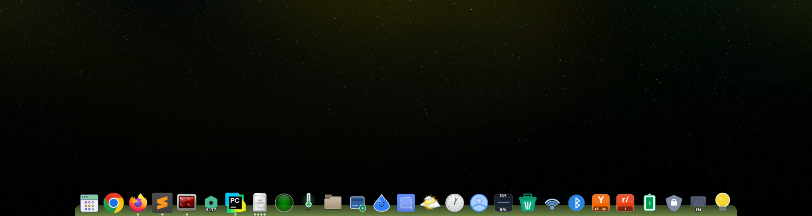
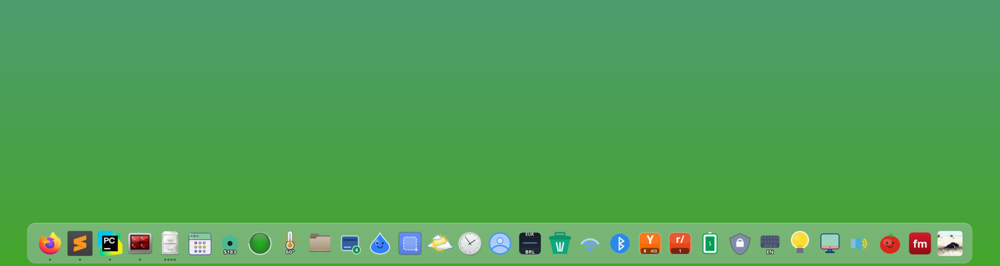

# Docking

[](https://github.com/edumucelli/docking/actions/workflows/ci.yml)
[](https://codecov.io/gh/edumucelli/docking)
[](https://github.com/edumucelli/docking/releases)
[](https://github.com/edumucelli/docking/releases)
[](https://www.python.org/)
[](#requirements)
[](#requirements)
[](LICENSE)
[](https://github.com/edumucelli/docking/commits/master)


A lightweight, feature-rich dock for Linux written in Python with GTK 3 and Cairo. Inspired by [Plank](https://launchpad.net/plank) and [Cairo-Dock](https://github.com/Cairo-Dock), with an extensible applet system for custom widgets.


## Contents

- [Highlights](#highlights)
- [Requirements](#requirements)
- [Installation](#installation)
- [Running](#running)
- [First Use](#first-use)
- [Global Search](#global-search)
- [Configuration](#configuration)
- [Applets](#applets)
- [Theming](#theming)
- [Writing Custom Applets](#writing-custom-applets)
- [Translations](#translations)
- [Developer Workflow](#developer-workflow)
- [Additional Docs](#additional-docs)
- [Contributing](#contributing)
- [License](#license)

## Highlights

- Fast launcher workflow with running indicators, previews, app actions, and drag-and-drop organization.
- Native Linux desktop integration across X11 and Wayland, with support for GNOME, KDE Plasma, Niri, wlroots compositors, MATE, Xfce, Cinnamon, and reduced fallback mode.
- Unified global search for applications, dock items, open windows, recent files, calculator expressions, and direct paths.
- 65 built-in applets for launching apps and commands, messaging, monitoring system state, controlling media, managing notes, files, folders, screenshots, power, networking, weather, and more.
- Folder stacks and pinned files/folders, so directories and documents can live directly in the dock alongside applications.
- Flexible dock layout with multi-position, multi-monitor, auto-hide, separators, and scalable sizing.
- Deep customization through 13 built-in themes, transparency, icon sizing, per-item custom icons, menu behavior, and tooltip controls.
- Broad release packaging: AppImage, Debian package, RPM, Flatpak, Snap, Arch package, and Nix output.
- Desktop integration details such as Unity LauncherEntry badge/progress support, X11 background blur region export, and 74 locale catalogs plus English fallback.
- Extensible Python applet system for adding custom dock-resident tools without changing the core runtime.

## Requirements

- Linux desktop with X11 (full support) or Wayland (backend-specific support)
- Python 3.10+
- Wayland backends:
  - GNOME / Mutter 45+ through the companion `docking-bridge@docking.org` extension
  - KDE Plasma 6 through the native KWin backend
  - wlroots-style compositors through layer-shell and advertised Wayland protocols
  - reduced mode when compositor integration is unavailable
- System packages (Ubuntu/Debian):

```bash
sudo apt install \
  python3-venv \
  python3-gi python3-gi-cairo \
  gir1.2-gtk-3.0 gir1.2-gdkpixbuf-2.0 gir1.2-wnck-3.0 gir1.2-pango-1.0 \
  gir1.2-nm-1.0 gir1.2-gstreamer-1.0 \
  libcairo2-dev libgirepository1.0-dev pkg-config
```

The WhatsApp applet additionally needs WebKitGTK. Install
`gir1.2-webkit2-4.1`, or `gir1.2-webkit2-4.0` on systems such as Ubuntu 22.04.

Native Wayland layer-shell source installs also need the system
`gtk-layer-shell` GIR package:

```bash
# Debian / Ubuntu
sudo apt install gir1.2-gtklayershell-0.1

# Fedora
sudo dnf install gtk-layer-shell

# Arch
sudo pacman -S gtk-layer-shell
```

Release packages include or depend on this where native Wayland support is
advertised. Source installs must install it separately.

Live Wayland protocol clients in source installs need the `[wayland]` extra:

```bash
# Debian / Ubuntu build dependencies for pywayland
sudo apt install libwayland-dev wayland-protocols

pip install -e ".[wayland]"
```

## Installation

The latest prebuilt packages are available on
[GitHub Releases](https://github.com/edumucelli/docking/releases) and linked
directly below.
- `AppImage`: [x64](https://github.com/edumucelli/docking/releases/latest/download/docking-latest-linux-x86_64.AppImage), [arm64](https://github.com/edumucelli/docking/releases/latest/download/docking-latest-linux-aarch64.AppImage)
- `Debian .deb`: [x64](https://github.com/edumucelli/docking/releases/latest/download/docking-latest-linux-x86_64.deb), [arm64](https://github.com/edumucelli/docking/releases/latest/download/docking-latest-linux-aarch64.deb)
- `RPM`: [x64](https://github.com/edumucelli/docking/releases/latest/download/docking-latest-linux-x86_64.rpm), [arm64](https://github.com/edumucelli/docking/releases/latest/download/docking-latest-linux-aarch64.rpm)
- `Flatpak`: [x64](https://github.com/edumucelli/docking/releases/latest/download/docking-latest-linux-x86_64.flatpak), [arm64](https://github.com/edumucelli/docking/releases/latest/download/docking-latest-linux-aarch64.flatpak)
- `Snap`: [x64](https://github.com/edumucelli/docking/releases/latest/download/docking-latest-linux-x86_64.snap), [arm64](https://github.com/edumucelli/docking/releases/latest/download/docking-latest-linux-aarch64.snap)
- `Arch package`: [x64](https://github.com/edumucelli/docking/releases/latest/download/docking-latest-linux-x86_64.pkg.tar.zst), [arm64](https://github.com/edumucelli/docking/releases/latest/download/docking-latest-linux-aarch64.pkg.tar.zst)
- `Nix`: [x64 store path](https://github.com/edumucelli/docking/releases/latest/download/docking-latest-linux-x86_64-nix-store-path.txt), [x64 output tarball](https://github.com/edumucelli/docking/releases/latest/download/docking-latest-linux-x86_64-nix-output.tar.gz), [arm64 store path](https://github.com/edumucelli/docking/releases/latest/download/docking-latest-linux-aarch64-nix-store-path.txt), [arm64 output tarball](https://github.com/edumucelli/docking/releases/latest/download/docking-latest-linux-aarch64-nix-output.tar.gz)

Typical local install/run commands after downloading a release asset:

```bash
# Choose the suffix matching the downloaded asset.
ARCH=x86_64  # Use aarch64 for ARM64.

# AppImage
chmod +x "docking-latest-linux-${ARCH}.AppImage"
./docking-latest-linux-${ARCH}.AppImage

# Debian / RPM / Arch
sudo apt install "./docking-latest-linux-${ARCH}.deb"
sudo dnf install "./docking-latest-linux-${ARCH}.rpm"
sudo pacman -U "./docking-latest-linux-${ARCH}.pkg.tar.zst"

# Flatpak / Snap
flatpak install --user "./docking-latest-linux-${ARCH}.flatpak"
sudo snap install --dangerous "./docking-latest-linux-${ARCH}.snap"

# Nix output tarball
mkdir docking-nix-output
tar -C docking-nix-output -xf "docking-latest-linux-${ARCH}-nix-output.tar.gz"
./docking-nix-output/bin/docking
```

```bash
# Clone
git clone https://github.com/edumucelli/docking.git
cd docking

# Create venv with access to system GI bindings
python3 -m venv --system-site-packages .venv
source .venv/bin/activate

# Install development dependencies, then GTK 3 type stubs without replacing
# the distribution-provided PyGObject runtime
pip install -e ".[dev]"
PYGOBJECT_STUB_CONFIG=Gtk3,Gdk3 \
  pip install --no-deps -r requirements-typing.txt
```

Or with [uv](https://docs.astral.sh/uv/):

```bash
uv venv --python /usr/bin/python3 --system-site-packages .venv
source .venv/bin/activate
uv pip install -e ".[dev]"
PYGOBJECT_STUB_CONFIG=Gtk3,Gdk3 \
  uv pip install --no-deps -r requirements-typing.txt
```

## Running

```bash
# Via entry point
docking

# Or directly
python run.py

# With debug logging
DOCKING_LOG_LEVEL=DEBUG python run.py
```

### Wayland Support

Docking selects a backend from the current desktop session. You can also force
one with `DOCKING_BACKEND`.

| Backend | Compositor | Coverage |
|---|---|---|
| **GNOME Shell bridge** | GNOME / Mutter 45+ | Full: dock placement, window tracking, window actions (activate / minimize / close), window previews, workspace switching, Show Desktop, Alt+Tab hiding |
| **KWin** | KDE Plasma 6 Wayland | Dock placement (layer-shell), window tracking with titles via AT-SPI accessibility bus, workspace switching via KWin D-Bus. No window actions (KWin 6 does not expose a public activate/close/minimize protocol) |
| **Hyprland** | Hyprland Wayland | Dock placement (layer-shell), IPC-based window tracking, active state, window actions, geometry, workspace association, and optional previews |
| **Niri** | Niri Wayland | Dock placement (layer-shell), IPC-based window tracking, active state, window actions (focus, close), window previews, workspace association |
| **Native layer-shell** | Protocol-capable Wayland compositors | Dock placement. Window tracking, workspace switching, previews, and idle-time support are enabled independently when the compositor publishes the corresponding standard protocols |
| **Cinnamon Wayland** | Current Muffin | Dock placement plus read-only running, active, attention, geometry, and workspace state through Muffin's `org.cinnamon.Muffin.Debug.ListWindows` snapshot API. Muffin does not expose window actions, previews, or change signals, so Docking polls every two seconds |
| **Native layer-shell** | GameScope | Dock placement as a GameScope external overlay. Docking automatically uses `GAMESCOPE_WAYLAND_DISPLAY`, including sessions started without `--expose-wayland`. GameScope does not expose general window management |
| **Native layer-shell** | Jay | Dock placement, window actions, workspaces, previews, and idle time after granting Docking the required Jay client capabilities |
| **Native layer-shell** | Miriway | Dock placement, window actions, and workspaces when Docking is launched as a trusted Miriway shell component |
| **Native layer-shell** | Phosh / phoc | Dock placement and window actions through standard protocols, with native per-window thumbnails when phoc exposes `phosh_private` to the client |
| **Treeland** | Deepin Wayland | Standard layer-shell window tracking and previews, plus Treeland Show Desktop and overlap-driven hiding. Left-edge overlap falls back until Treeland fixes its current left-anchor checker |
| **Reduced** | Cage | Launcher-only mode. Cage is a single-application kiosk and does not provide a layer-shell surface suitable for a dock |
| **Reduced** | Weston | Launcher-only mode. Weston's shell protocols are reserved for its configured shell or IVI controller, not general third-party docks |
| **Reduced** | Any Wayland | Dock visible but no window management (no running indicators, no previews, no workspace switching) |

#### GNOME Shell Bridge

On GNOME, Docking uses a companion GNOME Shell extension
(`docking-bridge@docking.org`) that provides window management, previews,
workspace switching, and Show Desktop over a private session D-Bus interface.

**How to enable:**
```bash
# Install and enable the extension (one-time)
tools/gnome_bridge.sh install

# Run the dock with the GNOME Shell bridge backend
DOCKING_BACKEND=gnome-shell docking
```

System packages include the extension. AppImage and Nix users should run
`tools/gnome_bridge.sh install` once, or copy
`docking/platform/backends/gnome/extension/` into the GNOME Shell user
extensions directory.

#### KWin / KDE Plasma 6

Docking auto-detects KDE Plasma 6 and uses the KWin backend without extra
configuration. The support table above summarizes the capabilities that KWin's
public interfaces make available. You can also select it explicitly with
`DOCKING_BACKEND=kwin`.

#### Native layer-shell

Native layer-shell mode needs a compositor with `zwlr_layer_shell_v1`.
See [Requirements](#requirements) for the `gtk-layer-shell` GIR and optional
live-protocol dependencies needed by source installs.

Check capabilities:
```bash
wayland-info | grep -E 'zwlr_layer_shell_v1|zwlr_foreign_toplevel_manager_v1|ext_workspace_manager_v1'
```

To force a specific backend for testing:
```bash
DOCKING_BACKEND=gnome-shell docking          # GNOME / Mutter 45+
DOCKING_BACKEND=kwin docking                  # KDE Plasma 6 Wayland
DOCKING_BACKEND=hyprland docking              # Hyprland IPC + layer-shell
DOCKING_BACKEND=niri docking                  # Niri IPC + layer-shell
DOCKING_BACKEND=wayland-layer-shell docking   # wlroots compositors
DOCKING_BACKEND=reduced docking               # any Wayland (no WM integration)
DOCKING_BACKEND=x11 docking                   # X11 (full support)
```

#### Jay client capabilities

Jay restricts window-management, workspace, capture, and idle protocols to
approved clients. Launch Docking with a connection tag:

```bash
jay run-tagged docking docking
```

Then grant that tag the protocols used by the generic Wayland backend:

```toml
[[clients]]
match.tag = "docking"
capabilities = [
    "layer-shell",
    "foreign-toplevel-manager",
    "foreign-toplevel-list",
    "workspace-manager",
    "screencopy",
    "idle-notifier",
]
```

Jay replaces its default permissions when a client rule matches, so
`layer-shell` must remain in the explicit list. A connection tag is preferred
over matching the process name because it grants these privileges only to the
Docking instance launched through `jay run-tagged`.

#### Miriway shell component

Miriway deliberately limits layer-shell, foreign-toplevel management, and
workspace management to trusted shell components. Add Docking to
`~/.config/miriway-shell.config`:

```ini
shell-component=docking
```

Restart Miriway after changing this file. Miriway then launches Docking with
the privileged Wayland socket. Starting Docking as an ordinary application
leaves these protocols hidden and results in reduced launcher-only behavior.

## First Use

Start by opening the dock menu: right-click the shelf background between icons.
If the dock is full or the background is hard to hit, hold **Ctrl** while
right-clicking anywhere on the shelf to show the same dock menu.

The first things to explore are:

- **Preferences**: open right-click -> **Preferences** to choose position,
  monitor behavior, icon size, zoom, hiding, click actions, themes, tooltips,
  previews, and update checks.
- **Add Applet**: right-click the shelf background -> **Add Applet** to add
  launchers, system status, media, productivity, and utility applets.
- **Add Separator**: right-click the shelf background where the separator
  should appear -> **Add Separator**.
- **Pin and remove items**: right-click a running app -> **Keep in Dock**,
  right-click a pinned item -> **Remove from Dock**, or drag an unlocked item
  off the dock to remove it.
- **Drag items in**: drop applications, `.desktop` files, files, folders, and
  AppImages onto the dock to pin them.
- **Customize icons**: right-click a pinned app, file, or folder -> **Icon** ->
  **Choose From File...** to use an image from disk, or reset it back to the
  automatically detected icon.
- **Folder stacks**: pin a folder and open it from the dock for quick access to
  its contents.
- **Diagnostics**: open right-click -> **Diagnostics** when checking backend
  support or preparing a support report.

## Global Search

Open **Search...** from the dock menu, use the optional **Search** applet, or
configure a system-wide shortcut under **Preferences -> Behavior -> Global
Search**. Search understands applications, windows, files, calculations,
conversions, dates, time zones, paths, and the web.

Try these examples:

- `Firefox` - find an installed application or open window.
- `Time in Sao Paulo` - check the current time in another city.
- `10 USD to EUR` - convert currencies using current rates.
- `10 + pi` - calculate an expression.
- `What is a Linux dockbar?` - search on the web.

Press **Enter** to open a result, **Ctrl+P** to preview it, or **Ctrl+J** for
more actions. See the [Global Search guide](docs/SEARCH.md) for provider details
and keyboard shortcuts.

## Configuration

Open right-click -> **Preferences** to configure the dock's appearance,
placement, behavior, applets, and update checks. **Display** moves the dock
between monitors, while **Diagnostics** reports the capabilities available in
the current desktop session.

Settings are saved automatically in `~/.config/docking/dock.json`. See the
[Configuration guide](docs/CONFIGURATION.md) for every setting, hide-mode and
mouse-action behavior, pinned entry formats, per-applet preferences, backups,
and safe manual editing.

## Theming

Docking includes thirteen built-in themes and supports custom JSON themes. A few examples:

| Default | Glass | Olive |
|---|---|---|
|  |  |  |

See the [Themes guide](docs/THEMES.md) for the complete gallery, custom-theme
instructions, and theme field reference.

## Applets

Docking includes 65 built-in applets, ranging from application
launchers and system controls to productivity tools, wellness reminders, and
live information.



| Category | Examples |
|---|---|
| Launcher & Navigation | Applications, Search, Run Application, Desktop, WhatsApp, Workspaces |
| Time & Productivity | Clock, Calendar, Alarm, Pomodoro, Calculator, Quick Note |
| System & Power | Devices, Network, Bluetooth, Volume, Battery, System Tray |
| Wellness & Ambient | Hydration, Plant Care, Stretch Coach, Ambient, Pet |
| Information and Environment | Weather, Sunrise, Moon, News, Reddit, Hacker News |

Add one from right-click -> **Add Applet**, then choose a category. See the
[Applets guide](docs/APPLETS.md) for the complete catalog, interactions,
preferences, update intervals, and integration requirements.

## Writing Custom Applets

Applets are discovered from `AppletMeta` metadata and loaded lazily when
enabled. They inherit the common lifecycle and UI hooks from
`docking/applets/base.py`, including `create_icon()`, click, scroll, and menu
handling, plus optional `start()` and `stop()` methods. Keep package imports
cheap and separate GTK wiring from pure state and rendering helpers so most
logic remains testable without a live desktop session.

```text
docking/applets/myapplet/
  __init__.py   # metadata only: AppletMeta declaration
  applet.py     # GTK wiring and lifecycle
  state.py      # pure state/logic helpers
  render.py     # icon rendering helpers
```

`__init__.py`:

```python
from docking.applets.identity import AppletCategory, AppletMeta

meta = AppletMeta(
    id="myapplet",
    name="My Applet",
    category=AppletCategory.PRODUCTIVITY,
)

__all__ = ["meta"]
```

`applet.py`:

```python
from docking.applets.base import Applet, load_theme_icon

class MyApplet(Applet):
    def create_icon(self, size):
        return load_theme_icon(name="my-icon", size=size)

    def refresh_tooltip(self):
        self.item.name = "My Applet"
        self.item.tooltip_text = "Useful status"

    def start(self, notify):
        super().start(notify)

    def stop(self):
        super().stop()
```

Use `self.present()` after state changes to refresh icon, tooltip, and dock UI.
Keep parsing/state logic in plain Python modules so tests do not need a display.

## Translations

Docking now ships 74 locale catalogs via standard gettext (plus English fallback).

Core locales include:

| Language | Code |
|----------|------|
| Brazilian Portuguese | pt_BR |
| Spanish | es |
| French | fr |
| Simplified Chinese | zh_CN |
| Hindi | hi |
| Arabic | ar |
| German | de |
| Japanese | ja |
| Korean | ko |
| Russian | ru |

Additional locales are available under `docking/locale/*/LC_MESSAGES/docking.po`.

The dock automatically uses your system locale. To test a specific language:

```bash
LANGUAGE=pt_BR python run.py
```

### Adding a new translation

Create a catalog from the template, edit it with a PO editor such as Poedit or
Lokalize, run the validation workflow below, and submit the `.po` file in a pull
request.

```bash
msginit --input=docking/locale/docking.pot \
  --locale=XX \
  --output=docking/locale/XX/LC_MESSAGES/docking.po
```

### Changing translatable strings

After adding or modifying a user-visible `_("...")` string, regenerate the
template and run the same checks as CI:

```bash
./tools/i18n.sh --extract
./tools/i18n.sh --check-pot-sync
./tools/i18n.sh --check-catalogs --allow-incomplete
./tools/i18n.sh --compile
```

Regular feature commits only update `docking/locale/docking.pot`; they do not
need to refresh every catalog or fill every new `msgstr`.

### Translation maintenance

Translation-only updates merge the current template into every catalog and can
apply the stricter completeness check:

```bash
./tools/i18n.sh --update-translations
./tools/i18n.sh --check-catalogs --require-complete
```

## Developer Workflow

### Tests

```bash
# Run all tests
pytest tests/ -v

# Run specific module
pytest tests/applets/test_clock.py -v

# Coverage report
pytest tests/ -v --cov=docking --cov-report=term-missing
```

For the GUI/integration-oriented slice under a headless X11 session:

```bash
bash tools/test_gui_headless.sh
```

Requirements for that mode:
- `xvfb-run`
- `dbus-run-session`

By default it runs the dock interaction/UI slice:
- pointer scenarios
- edges
- menu integration
- preview popup integration
- dock window integration
- interaction
- DnD integration
- renderer integration

You can also pass explicit pytest targets:

```bash
bash tools/test_gui_headless.sh tests/ui/test_pointer_scenarios.py
```

### D-Bus Remote Control

Docking exposes the `org.docking.Docking.Items1` session-bus interface for item
inspection and control. See [D-Bus Remote Control](docs/DBUS.md) for the method
reference, examples, and expected responses.

### Building Packages

Build dependencies, commands, output paths, and local installation steps for
every package format live in the [packaging guide](packaging/README.md).

## Additional Docs

- [Configuration](docs/CONFIGURATION.md)
- [Global Search](docs/SEARCH.md)
- [Applets](docs/APPLETS.md)
- [Themes](docs/THEMES.md)
- [D-Bus Remote Control](docs/DBUS.md)
- [Icon Assets and Packaging](docs/ICONS.md)
- [Packaging](packaging/README.md)

## Contributing

1. Fork the repository
2. Create a feature branch
3. Make your changes (tests required for new features)
4. Run `ruff format docking/ tests/` for formatting
5. Ensure `ruff check && ty check && pytest tests/` passes
6. Submit a pull request

## License

GPL-3.0-or-later
