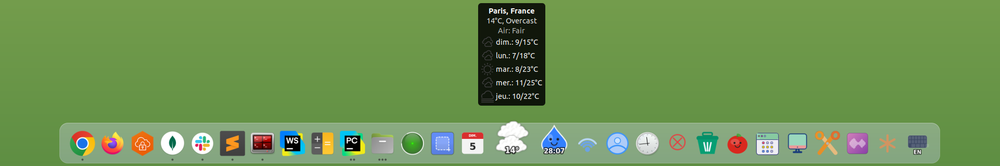
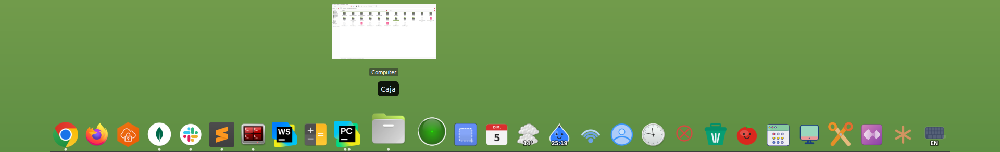
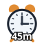
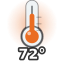
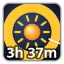
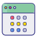
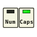
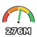

# Docking

[](https://github.com/edumucelli/docking/actions/workflows/ci.yml)
[](https://codecov.io/gh/edumucelli/docking)
[](https://github.com/edumucelli/docking/releases)
[](https://github.com/edumucelli/docking/releases)
[](https://www.python.org/)
[](#requirements)
[](#requirements)
[](LICENSE)
[](https://github.com/edumucelli/docking/commits/master)


A lightweight, feature-rich dock for Linux written in Python with GTK 3 and Cairo. Inspired by [Plank](https://launchpad.net/plank) and [Cairo-Dock](https://github.com/Cairo-Dock), with an extensible applet system for custom widgets.


## Contents

- [Features](#features)
- [Requirements](#requirements)
- [Installation](#installation)
- [Running](#running)
- [Configuration](#configuration)
- [Managing Dock Items](#managing-dock-items)
- [Applets](#applets)
- [Theming](#theming)
- [Writing Custom Applets](#writing-custom-applets)
- [Translations](#translations)
- [Developer Workflow](#developer-workflow)
- [Additional Docs](#additional-docs)
- [Contributing](#contributing)
- [License](#license)

## Features

Docking is built around a few core capabilities:

- Fast launcher workflow with running-state indicators and preview interactions.
- Flexible layout with multi-position, multi-monitor, auto-hide, and drag-and-drop organization.
- Broad customization through themes, transparency, icon sizing, menu options, and tooltip controls.
- Native support for pinned files/folders, including left-click folder stacks.
- Extensible applet surface for system status, productivity, media, and utilities.

Highlights:
- 52 built-in applets enabled from the dock menu, plus a separate dock separator item.
- 13 built-in themes with scalable layout values.
- Desktop-environment integration across MATE, Xfce, KDE, Cinnamon, GNOME, and others.
- Unity LauncherEntry support for per-app badge counts and progress bars on dock icons.
- Exports `_DOCKING_BACKGROUND_BLUR_REGION` on X11 so compositors and scripts can read the exact visible shelf rectangle.
- 74 locale catalogs plus English fallback.

## Requirements

- Linux with X11 for full dock functionality
- Wayland: full support on GNOME / Mutter 45+ via the companion
  `docking-bridge@docking.org` GNOME Shell extension; layer-shell support
  on wlroots-based compositors (Hyprland, Sway); reduced mode on other
  Wayland compositors. Recent GNOME / Mutter 45+ examples include Ubuntu
  26.04 LTS and Fedora Workstation 40+.
- Python 3.10+
- System packages (Ubuntu/Debian):

```bash
sudo apt install \
  python3-venv \
  python3-gi python3-gi-cairo \
  gir1.2-gtk-3.0 gir1.2-gdkpixbuf-2.0 gir1.2-wnck-3.0 gir1.2-pango-1.0 \
  gir1.2-nm-1.0 gir1.2-gstreamer-1.0 \
  libcairo2-dev libgirepository1.0-dev pkg-config
```

Optional native Wayland layer-shell placement requires a compositor with
layer-shell support plus the system `gtk-layer-shell` GIR package:

```bash
# Debian / Ubuntu
sudo apt install gir1.2-gtklayershell-0.1

# Fedora
sudo dnf install gtk-layer-shell

# Arch
sudo pacman -S gtk-layer-shell
```

This package is not a pip dependency. Docking imports it lazily only for native
Wayland layer-shell sessions. If it is missing, or the compositor does not
advertise layer-shell, Docking falls back to reduced native Wayland mode.

Live native Wayland protocol backends also need the optional Python extra:

```bash
# Debian / Ubuntu build dependencies for pywayland
sudo apt install libwayland-dev wayland-protocols

pip install -e ".[wayland]"
```

## Installation

Prebuilt latest release packages are also available on [GitHub Releases](https://github.com/edumucelli/docking/releases), you can download them directly below.
- `AppImage`: [x64](https://github.com/edumucelli/docking/releases/latest/download/docking-latest-linux-x86_64.AppImage), [arm64](https://github.com/edumucelli/docking/releases/latest/download/docking-latest-linux-aarch64.AppImage)
- `Debian .deb`: [x64](https://github.com/edumucelli/docking/releases/latest/download/docking-latest-linux-x86_64.deb), [arm64](https://github.com/edumucelli/docking/releases/latest/download/docking-latest-linux-aarch64.deb)
- `RPM`: [x64](https://github.com/edumucelli/docking/releases/latest/download/docking-latest-linux-x86_64.rpm), [arm64](https://github.com/edumucelli/docking/releases/latest/download/docking-latest-linux-aarch64.rpm)
- `Flatpak`: [x64](https://github.com/edumucelli/docking/releases/latest/download/docking-latest-linux-x86_64.flatpak), [arm64](https://github.com/edumucelli/docking/releases/latest/download/docking-latest-linux-aarch64.flatpak)
- `Snap`: [x64](https://github.com/edumucelli/docking/releases/latest/download/docking-latest-linux-x86_64.snap), [arm64](https://github.com/edumucelli/docking/releases/latest/download/docking-latest-linux-aarch64.snap)
- `Arch package`: [x64](https://github.com/edumucelli/docking/releases/latest/download/docking-latest-linux-x86_64.pkg.tar.zst), [arm64](https://github.com/edumucelli/docking/releases/latest/download/docking-latest-linux-aarch64.pkg.tar.zst)
- `Nix`: [x64 store path](https://github.com/edumucelli/docking/releases/latest/download/docking-latest-linux-x86_64-nix-store-path.txt), [x64 output tarball](https://github.com/edumucelli/docking/releases/latest/download/docking-latest-linux-x86_64-nix-output.tar.gz), [arm64 store path](https://github.com/edumucelli/docking/releases/latest/download/docking-latest-linux-aarch64-nix-store-path.txt), [arm64 output tarball](https://github.com/edumucelli/docking/releases/latest/download/docking-latest-linux-aarch64-nix-output.tar.gz)

Typical local install/run commands after downloading a release asset:

```bash
# AppImage
chmod +x docking-latest-linux-x86_64.AppImage
./docking-latest-linux-x86_64.AppImage
chmod +x docking-latest-linux-aarch64.AppImage
./docking-latest-linux-aarch64.AppImage

# Debian / RPM / Arch
sudo apt install ./docking-latest-linux-x86_64.deb
sudo apt install ./docking-latest-linux-aarch64.deb
sudo dnf install ./docking-latest-linux-x86_64.rpm
sudo dnf install ./docking-latest-linux-aarch64.rpm
sudo pacman -U ./docking-latest-linux-x86_64.pkg.tar.zst
sudo pacman -U ./docking-latest-linux-aarch64.pkg.tar.zst

# Flatpak / Snap
flatpak install --user ./docking-latest-linux-x86_64.flatpak
flatpak install --user ./docking-latest-linux-aarch64.flatpak
sudo snap install --dangerous ./docking-latest-linux-x86_64.snap
sudo snap install --dangerous ./docking-latest-linux-aarch64.snap

# Nix output tarball
mkdir docking-nix-output
tar -C docking-nix-output -xf docking-latest-linux-x86_64-nix-output.tar.gz
./docking-nix-output/bin/docking
```

```bash
# Clone
git clone https://github.com/edumucelli/docking.git
cd docking

# Create venv with access to system GI bindings
python3 -m venv --system-site-packages .venv
source .venv/bin/activate

# Install with dependencies
pip install -e ".[dev]"
```

Or with [uv](https://docs.astral.sh/uv/):

```bash
uv venv --python /usr/bin/python3 --system-site-packages .venv
source .venv/bin/activate
uv pip install -e ".[dev]"
```

## Running

```bash
# Via entry point
docking

# Or directly
python run.py

# With debug logging
DOCKING_LOG_LEVEL=DEBUG python run.py
```

### Wayland Support

X11 remains the primary backend. Native Wayland is supported through two
backends, selected automatically or via `DOCKING_BACKEND`:

| Backend | Compositor | Coverage |
|---|---|---|
| **GNOME Shell bridge** | GNOME / Mutter 45+ | Full: dock placement, window tracking, window actions (activate / minimize / close), window previews, workspace switching, Show Desktop, Alt+Tab hiding |
| **Native layer-shell** | wlroots-based (Hyprland, Sway) | Dock placement, window tracking, workspace switching (varies by compositor protocol support) |
| **Reduced** | Any Wayland | Dock visible but no window management (no running indicators, no previews, no workspace switching) |

#### GNOME Shell Bridge (Mutter 45+)

On GNOME, Docking uses a companion GNOME Shell extension
(`docking-bridge@docking.org`) that provides window management, previews,
workspace switching, and Show Desktop over a private session D-Bus interface.
Recent GNOME / Mutter 45+ examples include Ubuntu 26.04 LTS and Fedora
Workstation 40+.

**How to enable:**
```bash
# Install and enable the extension (one-time)
tools/gnome_bridge.sh install

# Run the dock with the GNOME Shell bridge backend
DOCKING_BACKEND=gnome-shell docking
```

The extension is included in the system package (deb / rpm / Arch) and
auto-enabled on install when a D-Bus session is available. AppImage and
Nix users should run `tools/gnome_bridge.sh install` once, or copy
`docking/platform/backends/gnome/extension/` to
`~/.local/share/gnome-shell/extensions/docking-bridge@docking.org/`.

#### Native layer-shell

Native Wayland layer-shell placement requires a compositor with
`zwlr_layer_shell_v1` plus the system `gtk-layer-shell` GIR package:

```bash
# Debian / Ubuntu
sudo apt install gir1.2-gtklayershell-0.1

# Fedora
sudo dnf install gtk-layer-shell

# Arch
sudo pacman -S gtk-layer-shell
```

Optional live Wayland protocol backends need the `[wayland]` extra:
```bash
sudo apt install libwayland-dev wayland-protocols
pip install -e ".[wayland]"
```

Check capabilities:
```bash
wayland-info | grep -E 'zwlr_layer_shell_v1|zwlr_foreign_toplevel_manager_v1|ext_workspace_manager_v1'
```

To force a specific backend for testing:
```bash
DOCKING_BACKEND=gnome-shell docking       # GNOME / Mutter 45+
DOCKING_BACKEND=wayland-layer-shell docking  # wlroots compositors
DOCKING_BACKEND=reduced docking           # any Wayland (no WM integration)
DOCKING_BACKEND=x11 docking               # X11 (full support)
```

## Configuration

Config is stored at `~/.config/docking/dock.json` (auto-created on first run). New installs are seeded with a starter dock: Applications, a set of common launchers detected from what is installed, then Clock, Calendar, Weather, System Monitor, Hydration, Notifications, and Session.

```json
{
  "icon_size": 48,
  "zoom_enabled": true,
  "zoom_percent": 1.5,
  "zoom_range": 3,
  "position": "bottom",
  "monitor_index": -1,
  "hide_mode": "none",
  "hide_delay_ms": 0,
  "unhide_delay_ms": 0,
  "hide_time_ms": 250,
  "previews_enabled": true,
  "tooltips_enabled": true,
  "lock_icons": false,
  "current_workspace_only": false,
  "anchor_applets": false,
  "anchor_files": false,
  "active_display": false,
  "left_click_action": "toggle",
  "middle_click_action": "new-window",
  "folder_stack_unfold": "hover",
  "show_window_count_numbers": false,
  "theme": "default",
  "transparency": 1.0,
  "pinned": [
    { "kind": "applet", "target": "applet://applications" },
    { "kind": "app", "target": "firefox.desktop" },
    { "kind": "app", "target": "org.gnome.Nautilus.desktop" },
    { "kind": "applet", "target": "applet://clock" }
  ],
  "applet_prefs": {},
  "item_prefs": {}
}
```

| Setting | Default | Description |
|---------|---------|-------------|
| `icon_size` | 48 | Base icon size in pixels (all theme proportions scale with this) |
| `zoom_enabled` | true | Enable or disable parabolic zoom on hover |
| `zoom_percent` | 1.5 | Zoom multiplier from `1.0` to `4.0` (`1.5` = 150%, `4.0` = 400%) |
| `zoom_range` | 3 | Icon widths over which zoom tapers off |
| `position` | bottom | Dock edge: bottom, top, left, right |
| `monitor_index` | -1 | Target monitor index (`-1` = primary monitor, `0..N` = specific monitor) |
| `hide_mode` | none | Dock hide behavior: `none`, `always-on-top`, `autohide`, `intelligent`, `dodge-active`, `window-dodge`, `dodge-maximized` |
| `hide_delay_ms` | 0 | Delay before hiding starts (0 = instant) |
| `unhide_delay_ms` | 0 | Delay before showing the dock again |
| `hide_time_ms` | 250 | Duration of hide/show slide animation |
| `previews_enabled` | true | Show window preview thumbnails on hover |
| `lock_icons` | false | Prevent reordering, drag-in, and drag-off removal |
| `current_workspace_only` | false | Only show running apps from the active workspace |
| `anchor_applets` | false | Keep applets anchored at the end of the dock |
| `anchor_files` | false | Keep file and folder entries anchored at the end independently |
| `tooltips_enabled` | true | Show hover tooltips for dock items |
| `active_display` | false | Follow the active monitor instead of staying on one display |
| `update_check_enabled` | true | Check GitHub for newer Docking releases |
| `update_check_interval_hours` | 24 | Minimum hours between automatic update checks |
| `left_click_action` | toggle | Running-app left click: `toggle`, `cycle`, or `most-recent` |
| `middle_click_action` | new-window | Application middle click: `new-window`, `minimize`, or `close-focused` |
| `folder_stack_unfold` | hover | Folder stack open behavior: `hover` or `click` |
| `show_window_count_numbers` | false | Show numeric window counts inside running indicators |
| `theme` | default | Theme name (loads from `~/.config/docking/themes/{name}.json` first, then built-in themes) |
| `transparency` | 1.0 | Multiplier applied to theme alpha from `0.15` to `1.0` (`1.0` = full theme opacity) |
| `pinned` | [] | Ordered pinned entries for apps, applets, files, and folders. First run seeds a starter set. |
| `applet_prefs` | `{}` | Per-applet preference storage |
| `item_prefs` | `{}` | Per-item preference storage for files and folders |

`hide_mode` meanings:

- `none`: Dock stays visible and reserves screen space.
- `always-on-top`: Dock stays visible above all windows without reserving screen space.
- `autohide`: Dock hides when the cursor leaves.
- `intelligent`: Dock hides when a window from the focused app overlaps the dock.
- `dodge-active`: Dock hides when the focused window overlaps the dock.
- `window-dodge`: Dock hides when any window on the current workspace overlaps the dock.
- `dodge-maximized`: Dock hides when the focused window is maximized or a dialog overlaps the dock.

All settings are also configurable via the dock's right-click menu. On multi-monitor setups, use **Display** to move the dock to another monitor. The preferences window also exposes **Mouse** actions so left click can toggle, cycle, or focus the most recently used window of the running app, and middle click can open a new window, minimize the app windows, or close the app's focused window. Pick the left-click mode under right-click -> **Preferences** -> **Behavior** -> **Mouse**. Update checks live under right-click -> **Preferences** -> **Updates**, where you can disable automatic checks, choose daily or weekly checks, check immediately, or open the releases page.

Docking stores update-check preferences in `dock.json`. Runtime update state,
such as the last checked timestamp, ignored release version, and remind-later
timestamp, is stored separately under XDG state storage in
`~/.local/state/docking/updates.json`.

## Managing Dock Items

- **Drag and drop**: Drag a `.desktop` file, and application, a folder or a file from your file manager onto the dock
- **Right-click running app**: "Keep in Dock" to pin
- **Drag off**: Drag an icon upward off the dock to remove (poof animation)
- **Right-click pinned app**: "Remove from Dock" to unpin
- **Edit config**: Add desktop IDs to `"pinned"` in `dock.json`

## Theming

Themes are JSON files. Docking loads user themes from:

```text
~/.config/docking/themes/
```

and then falls back to the built-in themes bundled in `docking/assets/themes/`.
Thirteen built-in themes are included:

- `default` -- light theme
- `onyx` -- dark variant
- `slate` -- flat appearance
- `transparent` -- minimal, see-through
- `olive` -- rounded olive-green theme
- `ember` -- warm dark theme
- `nord` -- cool, desaturated dark
- `glass` -- translucent macOS-style floating pill
- `pill` -- dark floating pill with fully rounded borders
- `paper` -- matte warm floating pill
- `candy` -- playful pastel floating pill
- `gruvbox` -- warm earthy dark
- `solarized` -- soft light Solarized variant

Theme examples:

| Theme | Preview |
| --- | --- |
| Glass |  |
| Transparent |  |

All layout values use a **scaling unit** (tenths of a percent of `icon_size`). This means themes adapt automatically to any icon size.

Theme field names use suffixes to make value types clear:

- `_px` means a raw pixel value in JSON/runtime, such as `shelf.stroke_width_px` or `layout.distance_from_edge_px`.
- No unit suffix means a theme scale unit in JSON, converted to pixels at runtime, such as `layout.horizontal_padding`, `layout.top_padding`, `layout.bottom_padding`, and `layout.item_padding`.
- `_ms` means milliseconds.
- `_ratio` means a relative fraction, such as a bounce height relative to icon size.
- `_color` means an RGBA color array stored as `[red, green, blue, alpha]` in 0-255 values.

Boolean, enum/string-choice, and count fields are exceptions and stay semantic without a type suffix, for example `shelf.round_bottom`, `indicators.style`, and `indicators.max_dots`.

Theme layout also controls edge spacing through `layout.distance_from_edge_px`, which is how floating themes such as `slate` keep the dock visually separated from the screen edge.

Older flat theme fields such as `h_padding` are migrated automatically when a user theme is loaded.

**Theme fields:**

`shelf.*` -- the dock background bar:

| Key | Default | Values | Notes |
|---|---|---|---|
| `shelf.fill_start_color` | `[222, 222, 222, 240]` | `[r, g, b, a]` (0-255) | Top color of the shelf vertical gradient. |
| `shelf.fill_end_color` | `[247, 247, 247, 240]` | `[r, g, b, a]` | Bottom color of the shelf gradient. |
| `shelf.stroke_color` | `[145, 145, 145, 255]` | `[r, g, b, a]` | Outer border color. |
| `shelf.stroke_width_px` | `1.0` | px | Outer border thickness. |
| `shelf.inner_stroke_color` | `[248, 248, 248, 255]` | `[r, g, b, a]` | Inset highlight stroke drawn 1px inside the outer border. |
| `shelf.corner_radius_px` | `5` | px | Rounded-corner radius. |
| `shelf.round_bottom` | `false` | bool | Round the bottom corners too (vs. square flush with the screen edge). |

`layout.*` -- item placement and edge spacing (scale units unless suffixed):

| Key | Default | Values | Notes |
|---|---|---|---|
| `layout.horizontal_padding` | `0` | scale units | Gap on each side of the item run. Values `<= 0` fall back to `2 * stroke_width`. |
| `layout.top_padding` | `-7` | scale units | Vertical offset of the shelf top relative to the icon top. Negative values make icons overflow above the shelf. |
| `layout.bottom_padding` | `1` | scale units | Gap between the shelf bottom and the screen edge. |
| `layout.item_padding` | `2.5` | scale units | Horizontal gap between adjacent icons. |
| `layout.distance_from_edge_px` | `0` | px | Gap between the dock and the screen edge. Floating themes (e.g. `slate`, `pill`) use this to lift the dock away from the edge. User setting `additional_distance_from_edge` is added on top of this. |

`indicators.*` -- running-app indicators below each icon:

| Key | Default | Values | Notes |
|---|---|---|---|
| `indicators.style` | `"dots"` | `"dots"`, `"dashes"` | Indicator shape under running apps. |
| `indicators.fill` | `"flat"` | `"flat"`, `"glow"` | Rendering style. `flat` is a solid disc/line; `glow` is a soft radial halo around each dot/dash. |
| `indicators.inactive_color` | `[80, 80, 80, 200]` | `[r, g, b, a]` | Color for running but not focused. |
| `indicators.active_color` | `[50, 50, 50, 255]` | `[r, g, b, a]` | Color for the currently focused app. |
| `indicators.size_px` | `5` | px | Indicator diameter (radius = `size_px / 2`). |
| `indicators.max_dots` | `4` | int | Maximum number of dots shown when an app has multiple windows. Above this, a count badge is drawn. |

`items.hover.*` -- hover lighten effect:

| Key | Default | Values | Notes |
|---|---|---|---|
| `items.hover.lighten_amount` | `0.2` | 0.0-1.0 | Additive brightness applied to the hovered icon. |
| `items.hover.fade_ms` | `150` | ms | Fade in/out duration for the hover lighten. |

`items.bounce.*` -- icon bounce animations:

| Key | Default | Values | Notes |
|---|---|---|---|
| `items.bounce.urgent_height_ratio` | `1.66` | fraction of `icon_size` | Peak height of the urgent-window bounce. |
| `items.bounce.urgent_time_ms` | `600` | ms | Duration of one urgent bounce. |
| `items.bounce.launch_height_ratio` | `0.625` | fraction of `icon_size` | Peak height of the app-launch bounce. |
| `items.bounce.launch_time_ms` | `600` | ms | Duration of one launch bounce. |
| `items.bounce.click_time_ms` | `300` | ms | Duration of the click feedback bounce. |

`items.glow.*` -- active-app shelf glow and urgent halo:

| Key | Default | Values | Notes |
|---|---|---|---|
| `items.glow.active_shape` | `"linear"` | `"linear"`, `"radial"`, `"flat"` | `linear` = vertical gradient under the icon (default). `radial` = halo centered behind the icon. `flat` = solid color fill. |
| `items.glow.active_tint` | `"icon"` | `"icon"`, `"theme"` | `icon` = tint the glow with the icon's averaged color. `theme` = use `items.glow.active_color`. |
| `items.glow.active_color` | mirrors `indicators.active_color` | `[r, g, b, a]` | Consumed only when `active_tint = "theme"`. |
| `items.glow.active_opacity_ratio` | `0.6` | 0.0-1.0 | Maximum alpha of the active-app glow gradient (linear/radial) or solid fill (flat). |
| `items.glow.urgent_time_ms` | `10000` | ms | How long the urgent halo around an icon stays visible after the urgent flag is set. |
| `items.glow.urgent_pulse_ms` | `2000` | ms | One pulse cycle period for the urgent halo. |
| `items.glow.urgent_size_ratio` | `0.6` | fraction of `icon_size` | Radius of the urgent halo. |

**Creating a custom theme:**
- Docking creates `~/.config/docking/themes/template.json` on startup.
- Copy `template.json` to a new name, such as `my-theme.json`, then edit it.
- `template.json` is hidden from the selector; renamed `.json` files appear as themes.

## Applets

Applets are custom widgets that live in the dock alongside application icons. Enable them via right-click on the dock background -> **Applets**.

### Applet Architecture

Docking applets follow a small, testable architecture:

- `docking/applets/base.py` defines the common applet lifecycle and UI hooks:
  - `create_icon(size)`
  - `on_clicked()`
  - `on_scroll(direction_up)`
  - `get_menu_items()`
  - optional `start(notify=...)` / `stop()`
- Most applets are organized as a package with three modules:
  - `state.py`: pure logic, parsing, command/state helpers (easy to unit test)
  - `render.py`: Cairo/icon rendering helpers (no applet lifecycle logic)
  - `applet.py`: GTK/Wnck/Gio wiring, timers, click/scroll/menu behavior
- Package `__init__.py` stays metadata-only: declare `meta = AppletMeta(...)` there and keep imports cheap for startup discovery.
- Applet metadata is auto-discovered through `docking/applets/__init__.py:get_applet_catalog()`.
- Concrete applet classes are loaded on demand through `docking/applets/__init__.py:load_applet_class()`.
- Each applet package declares a stable identity via `AppletMeta` in `__init__.py`.

This split keeps runtime behavior in one place while making parsers/rendering highly testable without a live desktop session.

### AI Usage


Tracks Claude Code, Codex CLI, and OpenCode usage from the dock.

**Scroll:** Cycle provider focus between Auto, Claude, Codex, and OpenCode
**Right-click options:**
- **Auto / Claude / Codex / OpenCode** -- filter the displayed provider
- **Reset Today** -- clear today’s tracked usage

**Tooltip:** Today/week cost summary plus per-model usage for the selected provider

**Update interval:** Updates when usage changes, plus a periodic refresh for providers that need polling

**Preferences stored:** rolling `days` usage history in `applet_prefs.aiusage`

### Clock


Analog or digital clock face. Optional seconds display adds a red seconds hand in analog mode and `HH:MM:SS` in digital mode, and the applet can keep a simple one-shot alarm reminder.

**Click:** Acknowledge a ringing alarm
**Right-click options:**
- **Digital Clock** -- switch between analog and digital display
- **24-Hour Clock** -- toggle 12/24-hour format
- **Show Date** -- show date below time (digital mode only)
- **Show Seconds** -- refresh every second and show seconds on the icon
- **Set Alarm...** -- choose an hour/minute for the next one-shot reminder
- **Clear Alarm** -- remove a pending alarm
- **Acknowledge Alarm** -- clear the urgent reminder after it fires

**Preferences stored:** `show_digital`, `show_military`, `show_date`, `show_seconds`, `alarm_target`

### Alarm



Multiple alarm presets with local-time scheduling, weekday repeats, one-shot alarms, snooze, and dismiss controls. The icon shows a rounded alarm clock with a compact next-alarm countdown, and switches to a ringing label when an alarm fires.

**Click:** Open the alarm editor, or dismiss the current ringing alarm
**Right-click options:**
- **Add Alarm...** -- create a new alarm preset
- **Snooze** -- move the current ringing alarm forward by its preset snooze duration
- **Dismiss** -- stop the current ringing alarm
- **Alarm preset rows** -- enable or disable saved presets from the menu
- **Edit {label}...** -- edit or remove a saved preset

**Tooltip:** Next enabled alarm with local time, or the currently ringing alarm label.

**Preferences stored:** `presets` with `label`, `hour`, `minute`, `enabled`, `repeat_days`, `snooze_minutes`, `last_triggered`, and `snoozed_until`

**Update interval:** 30 seconds normally, 1 second while ringing

### Trash


Shows the current state of the system trash. Icon switches between empty and full automatically.

**Click:** Open trash folder in file manager
**Right-click options:**
- **Open Trash** -- open in file manager
- **Empty Trash** -- permanently delete all trashed items

### USB Watch


Shows mounted removable USB storage devices and provides safe-remove actions without opening a file manager.

**Tooltip:** mounted device count and mount paths
**Right-click options:**
- **Safely Remove _device_** -- unmount and eject a removable USB device when supported

### Desktop


Toggle "show desktop" mode -- minimizes or restores all windows.

**Click:** Toggle show/hide all windows

### System Monitor


Circular gauge showing real-time CPU and memory usage. The fill color shifts from green (idle) to red (busy). A white arc around the edge shows memory usage.

**Tooltip:** `CPU: 23.5% | Mem: 67.2% | Temp: 54.0°C` when CPU temperature is available

**Update interval:** 1 second

### Thermals



Hottest lm-sensors temperature plus fastest fan RPM. The icon is a thermometer with a degree-only bottom label for the current temperature, and the tooltip includes the lm-sensors chip and label for both readings.

**Click:** No-op
**Right-click options:**
- **Temperature Unit** -- Celsius or Fahrenheit
- **Refresh Now**

**Tooltip:** `Hot: coretemp Package 72.4C` and `Fan: thinkpad fan1 2987 RPM`

**Update interval:** 5 seconds

### Battery


Shows battery charge level using standard icons. The icon changes based on charge level and charging state.

**Right-click options:**
- **Power Settings** -- open the desktop power settings or power management screen when available

**Tooltip:** Shows percentage and, when the system exposes a battery rate, the estimated time left or time until full. If no estimate is available, it keeps the tooltip simple.

**Update interval:** 60 seconds

### Brightness


Screen brightness control with a live level indicator.

**Click:** Reset brightness to 100%
**Scroll:** Adjust brightness by small steps
**Right-click options:**
- **Show Level** -- toggle percentage text overlay on icon

**Tooltip:** `Brightness: N%`

**Update interval:** 5 seconds

### Weather


Shows current weather and air quality for a selected city with a 5-day forecast.

**Click:** Open city search and add/switch the active city
**Right-click options:**
- **Show Temperature** -- toggle temperature overlay on icon
- **Temperature Unit** -- Celsius or Fahrenheit
- **Remove {city}** -- remove active city when multiple cities are configured

**Scroll:** Cycle through configured cities

**Tooltip:** Bold city header + current conditions + air quality + daily forecast with icons:
```
Contagem, Brazil
29°C, Clear sky
Air: Good
Mon: 25/29°C, Partly cloudy
Tue: 28/32°C, Rain
```

**Preferences stored:** `city_display`, `lat`, `lng`, `show_temperature`, `temperature_unit`

**Update interval:** 5 minutes

### Sunrise



Sunrise, sunset, and twilight countdown applet for a selected city. The icon is a rendered 24-hour solar dial with night, astronomical, nautical, civil, and daylight bands plus a current-time marker.

**Click:** Open city search and add/switch the active city
**Right-click options:**
- **Label Mode** -- switch between next-event countdown, current phase, and sunrise/sunset times
- **Remove {city}** -- remove active city when multiple cities are configured

**Scroll:** Cycle through configured cities

**Tooltip:** Selected city, current solar phase, next solar event countdown, and today's solar event times. Times are calculated locally from the city coordinates and shown in the system timezone.

**Preferences stored:** `cities`, `active_index`, `label_mode`

**Update interval:** 60 seconds

### Moon


Moon phase applet with a rendered moon disc and illumination shading.

**Click:** Refresh moon data now
**Right-click options:**
- **Show Phase Name** -- toggle phase label overlay on icon
- **Refresh** -- force a refresh

**Tooltip:** Multi-line phase summary with illumination percentage and description

**Update interval:** 6 hours

### Clippy


Clipboard history manager. Monitors the system clipboard and stores the last 15 text entries.

**Click:** Copy the currently selected clip back to the clipboard
**Scroll:** Cycle through clipboard history (tooltip updates instantly)
**Right-click:** List of all clips (newest first), click to copy. "Clear" to empty history.

**Preferences stored:** `max_entries`

### Bookmarks


Bookmarks launcher for pinned URLs.

**Click:** Open the first saved bookmark in the default browser
**Right-click options:**
- **Add Bookmark...** -- save a name + URL pair
- individual bookmark entries -- open that bookmark directly
- **Remove All** -- clear the saved bookmark list

**Tooltip:** summary of the saved bookmark set

### Quick Note


Sticky note applet for a single quick text note.

**Click:** Open the note editor dialog
**Right-click options:**
- **Edit Note** -- open the editor
- **Clear Note** -- empty the note

**Tooltip:** note preview or empty-note fallback

### Recent Files


Launcher for the most recently opened files.

**Click:** Open the newest recent file
**Right-click options:**
- recent file entries -- open the selected file
- **Clear Recent Files** -- purge the recent-files list

**Tooltip:** most recent file name or empty-state fallback

### Color Picker


Eyedropper color picker. Click enters fullscreen pick mode, samples a pixel color, copies hex value to clipboard, and updates the icon swatch.

**Click:** Start pick mode and sample next clicked pixel
**Right-click options:**
- **Copy #RRGGBB** -- copy current sampled value
- **Show Hex** -- toggle hex label overlay on icon

**Tooltip:** Current sampled hex value

**Preferences stored:** `show_hex`, `r`, `g`, `b`, `hex`

### Applications



Categorized application launcher. Groups all installed `.desktop` applications by FreeDesktop category (Multimedia, Development, Internet, etc.) with icons.

**Click:** Open the categorized launcher menu. The top of the menu includes a search field that filters applications as you type.

### Keyboard Layout


Keyboard layout switcher with a compact keyboard icon and active layout code overlay.

**Click:** Cycle to the next available layout
**Scroll:** Move forward/backward through available layouts
**Right-click options:**
- **Keyboard Settings** -- open the desktop keyboard settings screen when available
- **Show Current Layout** -- open the current keyboard layout dialog when available
- direct selection of each detected layout

**Tooltip:** active layout code or no-layout fallback

### Caps Lock



Caps Lock and Num Lock indicators for keyboards without physical lights. The icon shows which locks are currently active.

**Click:** Refresh lock state immediately
**Right-click options:**
- Current Caps Lock and Num Lock states
- Refresh Now

**Tooltip:** Caps Lock and Num Lock on/off state, or an unavailable-state fallback

**Update interval:** 1 second

### Network


Shows WiFi signal strength or wired connection status, with live upload/download speed overlay.

**Tooltip:**
```
WiFi: MyNetwork (82%)
IP: 192.168.1.42
down-arrow 1.2 MB/s  up-arrow 350 KB/s
```

**Right-click options:**
- **Available Networks** -- open a submenu of visible Wi-Fi networks; clicking one asks NetworkManager to connect to it
- **Connect to Hidden Wi-Fi Network...** -- open the desktop network editor/settings flow for hidden Wi-Fi setup
- **Create New Wi-Fi Network...** -- open the desktop network editor/settings flow for creating a new Wi-Fi network
- **VPN Connections** -- open a submenu of saved VPN profiles and toggle them on or off
- **Connection Information** -- open the desktop network settings or information screen when available
- **Edit Connections...** -- open the connection editor when available
- **Enable Networking** -- toggle NetworkManager networking on/off
- **Enable Wi-Fi** -- toggle Wi-Fi radio on/off when a wireless device is present
- **Show Download / Show Upload / Hide Speeds** -- control the speed overlay on the icon

**Update interval:** 2 seconds

### Bluetooth


Bluetooth manager applet for quick adapter and device control from the dock.

**Click:** Toggle Bluetooth power for the active adapter
**Right-click options:**
- **Turn Bluetooth On / Turn Bluetooth Off** -- power toggle for the active adapter
- **Disconnect {device}** -- quick disconnect action for connected devices
- **Send Files to Device...** -- open the desktop Bluetooth file sender when available
- **Recent Connections** -- reopen recently connected paired devices
- **Devices...** -- open the desktop Bluetooth devices/settings screen when available
- **Adapters...** -- open the desktop Bluetooth adapter/settings screen when available
- **Local Services...** -- open the desktop Bluetooth local-services screen when available
- **Continuous Discovery** -- keeps discovery active while enabled
- **Adapter** -- switch active adapter on multi-adapter systems
- **Connected / Paired / Discovered Devices** -- per-device actions:
  connect/disconnect, pair, remove pairing, trust toggle

**Tooltip:** adapter state, connected/paired counts, discovery status, optional battery line
**Badge:** connected device count

**Update interval:** 2 seconds

### Cam Shield


Camera privacy indicator. The icon shows a red dot while an app is using a camera.

**Right-click options:**
- Active app list when available
- Lock Camera / Unlock Camera
- Refresh Now

**Tooltip:** Shows whether the camera is idle, active, or unavailable, plus active holders when detected

Locking blocks new camera sessions. Apps that are already using the camera may need to be closed first.

**Update interval:** 2 seconds

### Mic Shield


Microphone privacy indicator and mute toggle. The icon shows a red dot while an app is using microphone input, and clicking the applet quickly mutes or unmutes the microphone.

**Click:** Toggle microphone mute
**Right-click options:**
- Active app list when available
- Mute Microphone / Unmute Microphone
- Refresh Now

**Tooltip:** Shows mute state, idle/active state, and active capture streams when detected

**Update interval:** 2 seconds

### Power Profiles


Power profile applet for quick laptop/handheld mode switching.

**Click:** Cycle to next available profile
**Right-click options:**
- **Select Profile** -- radio selector for available profiles
- **Power Saver / Balanced / Performance** -- set active profile

**Tooltip:** current profile and available profiles

### Notifications


Notification center applet with a compact status icon, Do Not Disturb toggle, and pending badge when available.

**Click:** Toggle Do Not Disturb on/off
**Right-click options:**
- **Do Not Disturb** -- toggle notification pause state
- **Pending: N** -- pending notifications (when available)
- **Clear Notifications** -- clear notification history (when available)

**Update interval:** 2 seconds

### Session


Lock, log out, suspend, restart, or shut down from the dock.

**Click:** Lock screen
**Right-click options:**
- **Lock Screen**
- **Log Out**
- **Suspend**
- **Restart**
- **Shut Down**

### Calendar


Shows today's date as a calendar page icon with red header (weekday) and day number.

**Click:** Toggle a calendar popup
**Tooltip:** Full date (e.g. "Tuesday, February 25")

**Update interval:** 30 seconds (refreshes icon at midnight)

### Workspaces


Workspace switcher with a visual grid icon. Active workspace is highlighted in blue.

**Click:** Cycle to next workspace
**Scroll:** Switch workspace up/down
**Right-click options:** Radio list of all workspaces

**Tooltip:** Active workspace name

### Screenshot


Capture screenshots with the available screenshot tool on your system.

**Click:** Full-screen capture
**Right-click options:**
- **Full Screen** -- capture entire screen
- **Window** -- capture active window
- **Region** -- interactive area selection
- **Full Screen in 3s/5s/7s/9s** -- delayed full-screen capture

### Volume


System volume control. The icon switches between muted, low, medium, and high based on level.

**Click:** Toggle mute
**Scroll:** Adjust volume ±5%
**Right-click options:**
- **Volume Settings** -- open the desktop volume or sound settings screen when available
**Tooltip:** `Volume: 75%` or `Muted`

**Update interval:** 1 second (refreshes only on change)

### Music


Media controller applet with album-art icon rendering.

**Click:** Play/pause
**Scroll:** Player volume ±5%
**Right-click options:**
- **Previous**
- **Play** / **Pause**
- **Next**
- **Volume Up** / **Volume Down**

**Tooltip:** multiline summary, e.g. `Artist - Title`, `Album: ...`, `Vol N%`

### Pomodoro


Pomodoro timer with a flat tomato icon. Auto-cycles through work/break phases with configurable durations. Triggers urgent bounce+glow on phase transitions.

**Click:** Start/pause toggle
**Right-click options:**
- **Reset** -- back to idle
- **Work duration** -- 15/25/30/45 min presets
- **Break duration** -- 5/10 min presets
- **Long break duration** -- 15/20/30 min presets

**Preferences stored:** `work`, `break_`, `long_break`

### Pet


Animated companion applet that reacts to system activity with different moods.

**Click:** reset the pet back to a happy state
**Tooltip:** current mood and CPU percentage


### Separator

Transparent gap divider between dock items. Supports multiple instances -- each with independent, persistent size.

**Scroll:** Adjust gap width (±2px, range 2–48px)
**Right-click options:**
- **Increase Gap** / **Decrease Gap**
- **Remove from Dock**

Added via right-click on dock background -> **Add Separator** (inserts at click position).

### Hydration


Water drop icon that drains over a configurable interval, reminding you to drink water. Click to refill. Triggers urgent bounce when empty.

**Click:** Refill (log a drink)
**Scroll:** No-op
**Right-click options:**
- **Show Timer** -- toggle countdown overlay on icon
- **Interval presets** -- 15/30/45/60/90 min

**Preferences stored:** `interval`, `show_timer`

### Stretch Coach


Periodic micro-break reminder applet with offline stretch cards. Reminders stay inside the dock: the icon becomes urgent when a break is due, and clicking acknowledges the reminder and restarts the timer.

**Click:** Trigger a break immediately when idle, or acknowledge the active reminder
**Scroll:** No-op
**Right-click options:**
- **Take Break Now** / **Acknowledge Break**
- **Show Random Stretch**
- **Random Stretch Cards** -- toggle offline card attachment on reminders
- **Interval presets** -- 15/30/45/60/90 min

**Preferences stored:** `interval`, `cards_enabled`

### Quote


Quote/joke applet inspired by the original Cairo-Dock Quote plugin. Ships with local fallback quotes and supports online refresh from active sources.

**Click:** Show next quote
**Right-click options:**
- **Next Quote**
- **Copy Quote** -- copy current quote to clipboard
- **Refresh from Web**
- **Source** -- switch source (Quotationspage, Qdb, Danstonchat, Viedemerde, Fmylife, Vitadimerda, Chucknorrisfactsfr)

**Preferences stored:** `source`

### Random Trivia


Quick trivia applet with local and online questions. The tooltip shows the current question and answer state, the menu exposes answer choices plus refresh/next actions, and the icon displays a small result pill after you answer: green for correct, red for wrong. The pill clears on the next trivia question.

**Click:** Show the next trivia question
**Scroll:** No-op
**Right-click options:**
- **Answer choices** -- pick an answer from the current question
- **Next Trivia**
- **Refresh from Web**

### Today in History


One-event-at-a-time history applet with online refresh and offline fallback data. It keeps the current event compact in the tooltip/menu, refreshes for the local date, and lets you step through notable events without leaving the dock.

**Click:** Show the next historical event for today
**Scroll:** No-op
**Right-click options:**
- **Next Event**
- **Refresh from Web**
- **Open Article** -- open the current event's Wikipedia page when available

### Hacker News


Hacker News headline viewer. It fetches HN top stories, keeps a cached list for startup, lazy-loads more when you land on the last loaded item, and shows the selected title plus points/comments in the tooltip. Paging continues up to 100 loaded headlines.

**Click:** Open the current story
**Scroll:** Cycle headlines
**Right-click options:**
- **Open Story**
- **Open Comments**
- **Next Headline**
- **Refresh Now**

**Update interval:** 10 minutes. Additional pages load on demand when you reach the last loaded headline, up to 100 stories.

**Preferences stored:** cached `stories`, `active_index`, `fetched_at`

### Ambient


Looping ambient soundscape player with 7 bundled nature sounds plus white and pink noise.

**Click:** Toggle play/stop
**Scroll:** Adjust volume ±10%
**Right-click:** Sound selection (Birds, Boat, Coffee Shop, Fireplace, Stream, Summer Night, Wind, White Noise, Pink Noise)

**Preferences stored:** `sound`, `volume`

### Calculator


Basic four-function calculator with a popup interface. Supports +, -, *, /, parentheses, and decimal numbers.

**Click:** Toggle calculator popup
**Keyboard:** Type expression, press Enter to evaluate

**Preferences stored:** `last_expression`

### Unit Converter


Convert between units directly from the dock popup. Supports length, weight, temperature, volume, speed, and data categories.

**Click:** Toggle converter popup

**Preferences stored:** `last_category`

### Currency FX


Live currency pair monitor with a sparkline icon. Add the pairs you care about, cycle between them from the dock, and choose the chart range that fits your glance.

**Click:** Add FX pair
**Scroll:** Cycle added pairs
**Right-click:** Refresh, swap pair, add pair, chart interval, switch/remove added pair

**Update interval:** 15 minutes. Day charts use local samples collected on each successful refresh; week and month charts use remote daily history plus the current rate.

**Preferences stored:** `pairs`, `active_index`, `chart_interval`, `sample_source`, `samples`

### URL Shortener


Shorten URLs with one click. Paste a URL, hit Shorten, and copy the result to the clipboard.

**Click:** Toggle URL shortener dialog
**Keyboard:** Paste URL, press Enter to shorten

**Preferences stored:** `last_url`

### Drag Share


Drop a local file onto the applet to upload it to tmpfiles.org and copy the returned URL to the clipboard. Files are temporary and expire automatically.

**Drop:** Upload file and copy URL
**Click:** Copy last uploaded URL again

**Preferences stored:** `last_url`

### Window Killer


Click the applet, then click any window to force-close it.

**Click:** Enter kill mode (cursor changes to crosshair)

### Cert Watch


Monitor certificate expiry for a list of domains. The shield color highlights the most urgent domain, and the icon shows the lowest days remaining so expiring certificates are easy to spot.

**Click:** Add domain dialog (accepts `example.com`, `example.com:8443`, or a full URL)

**Right-click menu:**
- Per-domain status with days remaining
- Add domain
- Remove submenu
- Refresh Now

**Update interval:** 1 hour. Failed certificate checks retry after 5 minutes.

**Preferences stored:** `domains` list (host, port)

### Speedtest



One-click internet speed test. The dial is painted as a classic four-band speedometer (red, orange, yellow, green from left to right); the needle points at the last download speed and takes its color from the current tier. The badge shows Mbps (e.g. `250Mb`, `1.2Gb`). Tooltip shows download, upload, ping, jitter, server, and timestamp.

**Click:** Run one test (~20 seconds: ping + 10s download + 10s upload)

**Right-click menu:**
- Summary header (Down / Up)
- Run Test (disabled while running)
- Copy Last Result (to clipboard)

**Update interval:** Manual. Results update only when you run a test.

**Preferences stored:** `last_result` (download_mbps, upload_mbps, ping_ms, jitter_ms, server, timestamp)

### Desk Presence


Tracks time at your desk versus away. The icon shows whether you are currently active or away, the bottom label shows today's at-desk hours, and the tooltip summarizes the recent daily breakdown.

**Right-click menu:**
- Status header (At desk / Away / Status unknown)
- Idle Threshold submenu (1 / 2 / 5 / 10 min presets)
- Reset Today

**Preferences stored:** `today` (ISO date), `at_desk_seconds`, `away_seconds`, `idle_threshold_s`, `history` (last 6 days)

### Astronomy Picture of the Day


Shows NASA's Astronomy Picture of the Day as a dock thumbnail. The tooltip includes the date, title, credit, and a short explanation, and the applet keeps showing a graceful placeholder if the image is unavailable.

**Click:** Open today's page on apod.nasa.gov in the default browser

**Right-click menu:**
- Title header (date + title)
- Open on apod.nasa.gov
- Copy Explanation
- Refresh Now

**Update interval:** 1 hour. The applet fetches again when the APOD date changes and retries errors after 10 minutes.

**Preferences stored:** `last_result` (date, title, explanation, media_type, image_url, page_url, copyright, cached_path)

## Writing Custom Applets

Applets extend the `Applet` abstract base class in `docking/applets/base.py`:

```python
from docking.applets.base import Applet, load_theme_icon

class MyApplet(Applet):
    id = "myapplet"
    name = "My Applet"       # display name in menus
    icon_name = "my-icon"    # fallback icon

    def create_icon(self, size):
        """Render your icon as a GdkPixbuf at the given size."""
        return load_theme_icon(name="my-icon", size=size)

    def on_clicked(self):
        """Handle left-click."""

    def on_scroll(self, direction_up):
        """Handle scroll wheel."""

    def get_menu_items(self):
        """Return list of Gtk.MenuItem for right-click menu."""
        return []

    def start(self, notify):
        """Called after dock is ready. Start timers/monitors."""
        super().start(notify)

    def stop(self):
        """Cleanup. Called on removal or shutdown."""
        super().stop()
```

**Key patterns:**
- Call `self.refresh_icon()` to trigger a redraw after state changes
- Use `self.save_prefs(dict)` / `self.load_prefs()` for persistent preferences
- Use `load_theme_icon(name, size)` for GTK theme icons
- Use `load_theme_icon_centered(name, size)` for non-square icons (e.g. battery)
- For Cairo rendering: create a surface, draw, return via `Gdk.pixbuf_get_from_surface()`
- For background work: use `threading.Thread` + `GLib.idle_add()` to dispatch results to main thread

Recommended file layout:

```text
docking/applets/myapplet/
  __init__.py   # metadata only: AppletMeta declaration
  applet.py     # GTK wiring and lifecycle
  state.py      # pure state/logic helpers
  render.py     # icon rendering helpers
```

Declare applet metadata in `docking/applets/myapplet/__init__.py` so catalog discovery can find it. Keep this file metadata-only so applet discovery stays cheap:

```python
from docking.applets.identity import AppletCategory, AppletMeta

meta = AppletMeta(
    id="myapplet",
    name="My Applet",
    category=AppletCategory.PRODUCTIVITY,
)

__all__ = ["meta"]
```

The concrete `Applet` subclass should live in `docking/applets/myapplet/applet.py`. `load_applet_class()` imports that module lazily when the applet is actually enabled.

**Design principle:** Complex logic is extracted as pure functions (no GTK dependency) so tests run fast without a display server. GTK-dependent tests use lightweight mocks.

## Translations

Docking now ships 74 locale catalogs via standard gettext (plus English fallback).

Core locales include:

| Language | Code |
|----------|------|
| Brazilian Portuguese | pt_BR |
| Spanish | es |
| French | fr |
| Simplified Chinese | zh_CN |
| Hindi | hi |
| Arabic | ar |
| German | de |
| Japanese | ja |
| Korean | ko |
| Russian | ru |

Additional locales are available under `docking/locale/*/LC_MESSAGES/docking.po`.

The dock automatically uses your system locale. To test a specific language:

```bash
LANGUAGE=pt_BR python run.py
```

### Adding a new translation

1. Create a new `.po` file from the template:
   ```bash
   msginit --input=docking/locale/docking.pot --locale=XX --output=docking/locale/XX/LC_MESSAGES/docking.po
   ```
2. Edit the `.po` file with a PO editor (e.g. Poedit, Lokalize, or any text editor)
3. Compile: `./tools/i18n.sh --compile`
4. Submit a pull request

### Updating the string template

After adding or modifying translatable strings in the source code:

```bash
./tools/i18n.sh --extract
```

This regenerates `docking/locale/docking.pot`. Existing `.po` files are updated separately in translation-refresh pull requests.

### When CI fails after adding `_()` strings

If you add a new user-visible translatable string such as `_("...")`, CI can fail in two common ways:

- `--check-pot-sync` fails because `docking/locale/docking.pot` is stale
- `--check-catalogs --allow-incomplete` fails because an existing locale catalog has format errors

Regenerate the template:

```bash
./tools/i18n.sh --extract
```

You do not need to update every `docking.po` catalog or fill in every new `msgstr` on regular feature commits. That creates large translation diffs that obscure the code review. Translation catalogs are refreshed periodically in translation-only pull requests:

```bash
./tools/i18n.sh --update-translations
```

To verify locally with the same i18n gates CI uses:

```bash
./tools/i18n.sh --check-pot-sync
./tools/i18n.sh --check-catalogs --allow-incomplete
./tools/i18n.sh --compile
```

Practical sequence:

1. `./tools/i18n.sh --extract`
2. Rerun the three checks above
3. Leave `.po` refreshes for a translation-only PR unless this branch is specifically about translations

### Unified i18n command

`./tools/i18n.sh` is the single translation utility. Common commands:

```bash
# Extract/update docking.pot
./tools/i18n.sh --extract

# Verify docking.pot is in sync with source strings
./tools/i18n.sh --check-pot-sync

# Update docking.pot, merge every locale catalog, and strip obsolete entries
./tools/i18n.sh --update-translations

# Validate locale catalogs while allowing incomplete translation backlog
./tools/i18n.sh --check-catalogs --allow-incomplete

# Strict translation-maintenance validation, fails on untranslated/fuzzy
./tools/i18n.sh --check-catalogs --require-complete

# Compile all .po catalogs to .mo
./tools/i18n.sh --compile
```

## Developer Workflow

### Tests

```bash
# Run all tests
pytest tests/ -v

# Run specific module
pytest tests/applets/test_clock.py -v

# Coverage report
pytest tests/ -v --cov=docking --cov-report=term-missing
```

For the GUI/integration-oriented slice under a headless X11 session:

```bash
bash tools/test_gui_headless.sh
```

Requirements for that mode:
- `xvfb-run`
- `dbus-run-session`

### D-Bus Remote Control

Docking exposes a small session-bus API for item inspection and control.

- Bus name: `org.docking.Docking`
- Object path: `/org/docking/Docking`
- Interface: `org.docking.Docking.Items1`

Current methods:
- `GetCount`
- `ListPinnedIds`
- `ListTransientIds`
- `Pin`
- `Unpin`
- `Remove`
- `GetHoverAnchor`

Example:

```bash
gdbus call --session \
  --dest org.docking.Docking \
  --object-path /org/docking/Docking \
  --method org.docking.Docking.Items1.ListPinnedIds
```

For full examples and expected responses, see [docs/DBUS.md](docs/DBUS.md).

By default it runs the dock interaction/UI slice:
- pointer scenarios
- edges
- menu integration
- preview popup integration
- dock window integration
- interaction
- DnD integration
- renderer integration

You can also pass explicit pytest targets:

```bash
bash tools/test_gui_headless.sh tests/ui/test_pointer_scenarios.py
```

### Building Packages

#### Building a .deb package

```bash
# Install build dependencies
sudo apt install python3-all python3-setuptools python3-wheel python3-pip \
  debhelper dh-python pybuild-plugin-pyproject

# Build
./packaging/deb/build.sh

# Install generated package
sudo dpkg -i ../docking_*_*.deb
sudo apt-get -f install
```

#### Building a Flatpak bundle

```bash
# Install tooling
sudo apt install flatpak flatpak-builder

# Build bundle
./packaging/flatpak/build.sh

# Install and run locally
flatpak install --user ./artifacts/cc.docking.Docking.flatpak
flatpak run cc.docking.Docking
```

#### Building a Snap package

```bash
# Install tooling
sudo apt install snapcraft

# Build snap package
snapcraft --destructive-mode --project-dir packaging/snap --output artifacts/docking.snap

# Install locally
sudo snap install --dangerous artifacts/docking.snap
```

#### Building an Arch package

```bash
# Arch Linux tooling
sudo pacman -S --needed base-devel git python python-pip

# Build package
./packaging/arch/build.sh

# Install locally
sudo pacman -U artifacts/docking-*.pkg.tar.*
```

#### Building with Nix

```bash
# Build package output
./packaging/nix/build.sh

# Run from build output
./result-nix/bin/docking
```

### Pre-commit Hooks

Runs automatically on `git commit`:
- **check-yaml** -- validate YAML files
- **end-of-file-fixer** -- ensure trailing newline
- **trailing-whitespace** -- remove trailing spaces
- **ruff format** -- code formatting
- **ruff check** -- linting (E, W, F, I rules)
- **ty check** -- type checking
- **i18n-pot-sync** -- ensure `docking/locale/docking.pot` matches source strings (`./tools/i18n.sh --check-pot-sync`)
- **i18n-catalogs** -- fail if existing PO catalogs have format errors, while allowing untranslated/fuzzy backlog (`./tools/i18n.sh --check-catalogs --allow-incomplete`)
- **pytest** -- full test suite

Install/update the local hook with:

```bash
./tools/install_precommit_hook.sh
```

### CI/CD Pipeline

GitHub Actions is split across two workflows:

- **`CI`** (`.github/workflows/ci.yml`)
  - Triggers on push to `master`, PRs to `master`, and `v*` tags.
  - **Quality**: `ruff check`, `ruff format --check`, `ty check`.
  - **Test matrix**:
    - Ubuntu 22.04 / Python 3.10
    - Ubuntu 24.04 / Python 3.12
    - Ubuntu 24.04 ARM64 / Python 3.12
    - Debian 11 / Python 3.10
    - Debian 12 / Python 3.12
  - **Coverage**: pytest-cov on Ubuntu with `--cov-fail-under=55`, artifacts uploaded (XML/HTML), optional Codecov upload when token is configured.
  - **Packaging artifacts**:
    - `.deb` (x64 and arm64)
    - `.rpm` (x64 and arm64)
    - `.flatpak` (x64 and arm64)
    - `.snap` (x64 and arm64)
    - `.AppImage` (x64 and arm64)
    - Arch package (`.pkg.tar.*`, x64 and arm64)
    - Nix output tarball + store path (x64 and arm64)
  - **Release naming**:
    - arch-specific assets use `linux-x86_64` for x64 and `linux-aarch64` for arm64
    - Debian now follows the same naming and publishes `linux-x86_64.deb` and `linux-aarch64.deb`
  - **Release step (CD)**:
    - Runs on `master` only after all package builds.
    - Reads version from `pyproject.toml`, checks latest GitHub Release, and only releases if version is newer.
    - Creates/pushes `v<version>` tag (if missing), normalizes artifact names, and publishes a GitHub Release with standardized files.

- **`Security`** (`.github/workflows/security.yml`)
  - Triggers on push/PR to `master` plus weekly schedule (`0 6 * * 1`).
  - Runs:
    - `pip-audit` against runtime dependencies exported from `pyproject.toml`
    - `bandit` SAST scan on `docking/` (excluding tests/packaging)

## Additional Docs

- [Architecture Maintainer Map](docs/ARCHITECTURE.md)
- [Icon Assets and Packaging](docs/ICONS.md)

## Contributing

1. Fork the repository
2. Create a feature branch
3. Make your changes (tests required for new features)
4. Run `ruff format docking/ tests/` for formatting
5. Ensure `ruff check && ty check && pytest tests/` passes
6. Submit a pull request

## License

GPL-3.0-or-later
