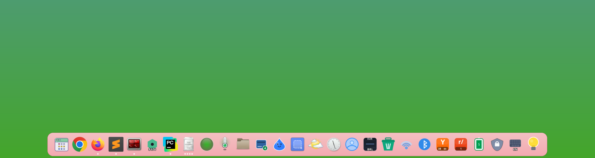
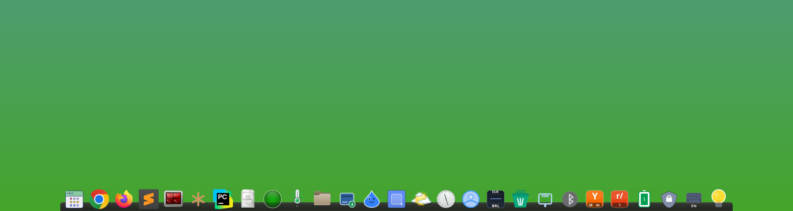
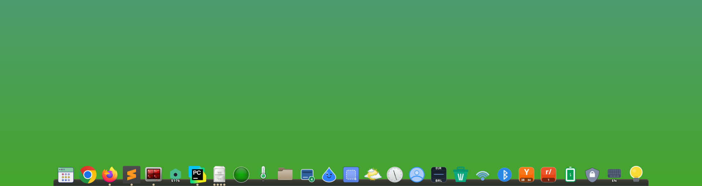
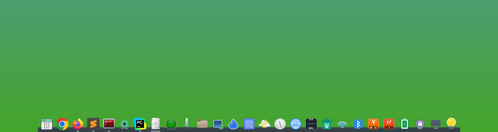
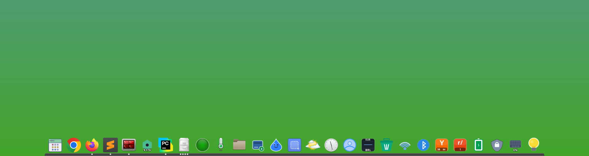
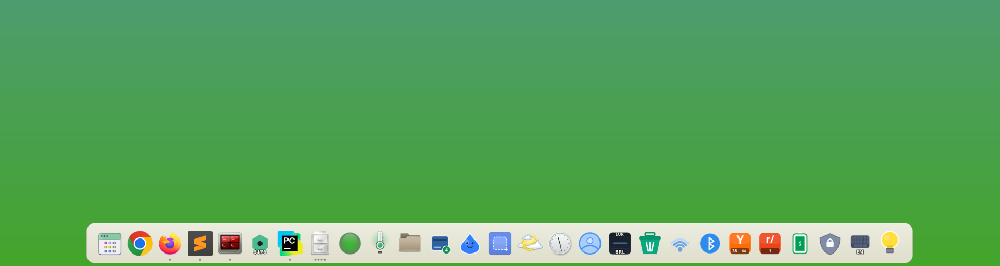
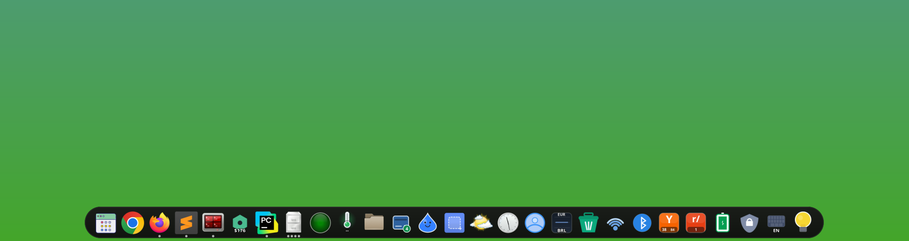
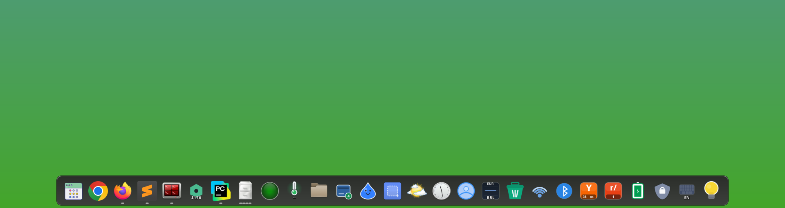
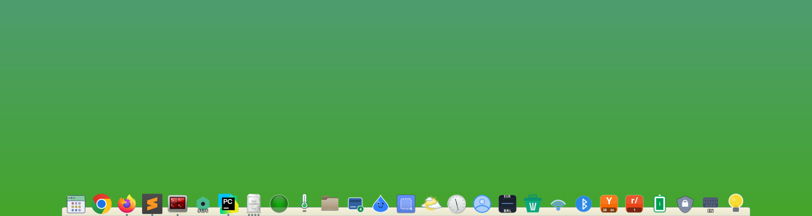
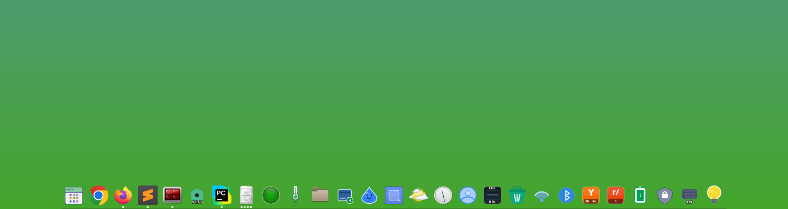

# Themes

Docking includes thirteen themes and supports custom themes stored as JSON files.

## Built-in Themes

| Candy | Default |
|---|---|
|  |  |
| Ember | Glass |
|  |  |
| Gruvbox | Nord |
|  |  |
| Olive | Onyx |
|  |  |
| Paper | Pill |
|  |  |
| Slate | Solarized |
|  |  |
| Transparent | |
|  | |

## Theme Files

Docking loads user themes from:

```text
~/.config/docking/themes/
```

It then falls back to the built-in themes bundled in
`docking/assets/themes/`. The included themes are `default` (light), `onyx`
(dark), `slate` (flat), `transparent`, `olive`, `ember`, `nord`, `glass`,
`pill`, `paper`, `candy`, `gruvbox`, and `solarized`.

All layout values use a **scaling unit** (tenths of a percent of `icon_size`).
This means themes adapt automatically to any icon size.

Theme field names use suffixes to make value types clear:

- `_px` means a raw pixel value in JSON/runtime, such as
  `shelf.stroke_width_px` or `layout.distance_from_edge_px`.
- No unit suffix means a theme scale unit in JSON, converted to pixels at
  runtime, such as `layout.horizontal_padding`, `layout.top_padding`,
  `layout.bottom_padding`, and `layout.item_padding`.
- `_ms` means milliseconds.
- `_ratio` means a relative fraction, such as a bounce height relative to icon
  size.
- `_color` means an RGBA color array stored as `[red, green, blue, alpha]` in
  0-255 values.

Boolean, enum/string-choice, and count fields are exceptions and stay semantic
without a type suffix, for example `shelf.round_bottom`, `indicators.style`,
and `indicators.max_dots`.

Theme layout also controls edge spacing through
`layout.distance_from_edge_px`, which is how floating themes such as `slate`
keep the dock visually separated from the screen edge.

Older flat theme fields such as `h_padding` are migrated automatically when a
user theme is loaded.

## Theme Fields

### Shelf

`shelf.*` controls the dock background bar:

| Key | Default | Values | Notes |
|---|---|---|---|
| `shelf.fill_start_color` | `[222, 222, 222, 240]` | `[r, g, b, a]` (0-255) | Top color of the shelf vertical gradient. |
| `shelf.fill_end_color` | `[247, 247, 247, 240]` | `[r, g, b, a]` | Bottom color of the shelf gradient. |
| `shelf.stroke_color` | `[145, 145, 145, 255]` | `[r, g, b, a]` | Outer border color. |
| `shelf.stroke_width_px` | `1.0` | px | Outer border thickness. |
| `shelf.inner_stroke_color` | `[248, 248, 248, 255]` | `[r, g, b, a]` | Inset highlight stroke drawn 1px inside the outer border. |
| `shelf.corner_radius_px` | `5` | px | Rounded-corner radius. |
| `shelf.round_bottom` | `false` | bool | Round the bottom corners too (vs. square flush with the screen edge). |

### Layout

`layout.*` controls item placement and edge spacing. Values use scale units
unless suffixed:

| Key | Default | Values | Notes |
|---|---|---|---|
| `layout.horizontal_padding` | `0` | scale units | Gap on each side of the item run. Values `<= 0` fall back to `2 * stroke_width`. |
| `layout.top_padding` | `-7` | scale units | Vertical offset of the shelf top relative to the icon top. Negative values make icons overflow above the shelf. |
| `layout.bottom_padding` | `1` | scale units | Gap between the shelf bottom and the screen edge. |
| `layout.item_padding` | `2.5` | scale units | Horizontal gap between adjacent icons. |
| `layout.distance_from_edge_px` | `0` | px | Gap between the dock and the screen edge. Floating themes (e.g. `slate`, `pill`) use this to lift the dock away from the edge. User setting `additional_distance_from_edge` is added on top of this. |

### Indicators

`indicators.*` controls running-app indicators below each icon:

| Key | Default | Values | Notes |
|---|---|---|---|
| `indicators.style` | `"dots"` | `"dots"`, `"dashes"` | Indicator shape under running apps. |
| `indicators.fill` | `"flat"` | `"flat"`, `"glow"` | Rendering style. `flat` is a solid disc/line; `glow` is a soft radial halo around each dot/dash. |
| `indicators.inactive_color` | `[80, 80, 80, 200]` | `[r, g, b, a]` | Color for running but not focused. |
| `indicators.active_color` | `[50, 50, 50, 255]` | `[r, g, b, a]` | Color for the currently focused app. |
| `indicators.size_px` | `5` | px | Indicator diameter (radius = `size_px / 2`). |
| `indicators.max_dots` | `4` | int | Maximum number of dots shown when an app has multiple windows. Above this, a count badge is drawn. |

### Hover Effects

`items.hover.*` controls the hover lighten effect:

| Key | Default | Values | Notes |
|---|---|---|---|
| `items.hover.lighten_amount` | `0.2` | 0.0-1.0 | Additive brightness applied to the hovered icon. |
| `items.hover.fade_ms` | `150` | ms | Fade in/out duration for the hover lighten. |

### Bounce Animations

`items.bounce.*` controls icon bounce animations:

| Key | Default | Values | Notes |
|---|---|---|---|
| `items.bounce.urgent_height_ratio` | `1.66` | fraction of `icon_size` | Peak height of the urgent-window bounce. |
| `items.bounce.urgent_time_ms` | `600` | ms | Duration of one urgent bounce. |
| `items.bounce.launch_height_ratio` | `0.625` | fraction of `icon_size` | Peak height of the app-launch bounce. |
| `items.bounce.launch_time_ms` | `600` | ms | Duration of one launch bounce. |
| `items.bounce.click_time_ms` | `300` | ms | Duration of the click feedback bounce. |

### Glow Effects

`items.glow.*` controls the active-app shelf glow and urgent halo:

| Key | Default | Values | Notes |
|---|---|---|---|
| `items.glow.active_shape` | `"linear"` | `"linear"`, `"radial"`, `"flat"` | `linear` = vertical gradient under the icon (default). `radial` = halo centered behind the icon. `flat` = solid color fill. |
| `items.glow.active_tint` | `"icon"` | `"icon"`, `"theme"` | `icon` = tint the glow with the icon's averaged color. `theme` = use `items.glow.active_color`. |
| `items.glow.active_color` | mirrors `indicators.active_color` | `[r, g, b, a]` | Consumed only when `active_tint = "theme"`. |
| `items.glow.active_opacity_ratio` | `0.6` | 0.0-1.0 | Maximum alpha of the active-app glow gradient (linear/radial) or solid fill (flat). |
| `items.glow.urgent_time_ms` | `10000` | ms | How long the urgent halo around an icon stays visible after the urgent flag is set. |
| `items.glow.urgent_pulse_ms` | `2000` | ms | One pulse cycle period for the urgent halo. |
| `items.glow.urgent_size_ratio` | `0.6` | fraction of `icon_size` | Radius of the urgent halo. |

## Creating a Custom Theme

- Docking creates `~/.config/docking/themes/template.json` on startup.
- Copy `template.json` to a new name, such as `my-theme.json`, then edit it.
- `template.json` is hidden from the selector; renamed `.json` files appear as
  themes.
